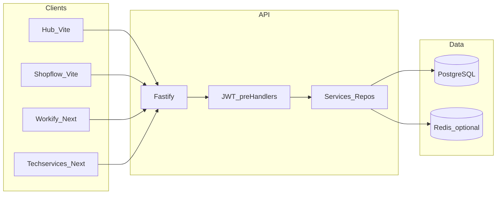
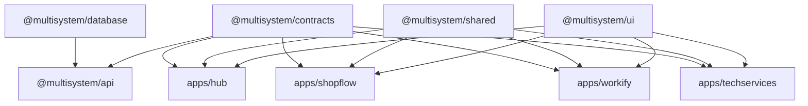
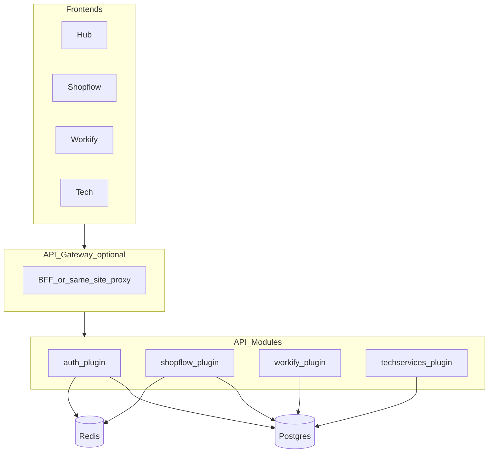

# Engineering Audit & Architecture Report

**Repository:** multisystem  
**Stack:** pnpm + Turborepo · React (Vite + Next.js) · Fastify · Prisma · PostgreSQL/Neon  
**Audit date:** 2026-03-18  
**Method:** Static review of `packages/api`, `packages/database`, `packages/shared`, `apps/*`; tooling: Knip (unused files), Madge (circular, API src).

---

## 1. Executive Summary

| Area | Assessment |
|------|------------|
| **Architecture quality** | **Good.** Single shared REST API with clear controller → service → repository layering, Zod validation, global error mapping, URL versioning (`/api/v1/*`), multi-tenant hooks (`requireCompanyContext`, module gating, Shopflow store scoping). |
| **Major risks** | JWT stored in **non-httpOnly** cookie (XSS → token theft); **CORS defaults** omit hub port `3001` unless `.env` is aligned; **one Fastify app** carries all domains (blast radius, deploy coupling). |
| **Strengths** | `@multisystem/contracts`, centralized `ApiClient` + cookie auth in `shared`, Redis-backed module cache, `AppError` / `ValidationError` discipline, Vitest in API, Prisma single schema for all modules. |
| **Key recommendations** | Prefer **httpOnly** session or BFF pattern for tokens; align **CORS** with all app origins; add **Knip/tsconfig** per app to reduce false positives; consolidate duplicate **ApiClient** in shopflow/workify if still present; optional **rate limits per route** for auth. |

---

## 2. Architecture Overview

### SPA + API model

- **Hub** (`apps/hub`) and **Shopflow** (`apps/shopflow`): Vite + React, client-side routing.
- **Workify** / **Techservices**: Next.js (ports 3003/3004 per README), can use App Router + client fetch to shared API.
- **API** (`packages/api`): Fastify on port 3000 (or serverless on Vercel). All business modules (auth, companies, shopflow, workify, techservices) mount on `/api/*`.

### Hosting model (not IIS)

- Local: Node listens `0.0.0.0`; Postgres via Docker (`docker-compose.yml`).
- Production path implied by scripts: **Vercel** for API (`VERCEL` branch), **Neon** + optional **Upstash Redis** for module cache.

### System boundaries

| Boundary | Responsibility |
|----------|------------------|
| Browser apps | UI, React Query cache, cookie + Bearer attachment |
| `@multisystem/shared` | Cookie JWT read/write, `ApiClient`, prefixed module APIs |
| `@multisystem/api` | Auth, RBAC/module checks, persistence orchestration |
| `@multisystem/database` | Prisma schema, migrations, generated client |

### Data flow (Mermaid)



---

## 3. Repository Structure Map

```
multisystem/
├── apps/
│   ├── hub/                 # Portal: login, company switch, dashboard (Vite + React 19)
│   ├── shopflow/            # POS / inventory module UI (Vite)
│   ├── workify/             # HR module UI (Next.js)
│   └── techservices/        # Field service UI (Next.js)
├── packages/
│   ├── api/                 # Fastify REST API (controllers, services, repositories, DTOs)
│   ├── component-library/   # @multisystem/ui (shared React components)
│   ├── contracts/           # Shared TS types / API response shapes
│   ├── database/            # Prisma schema, migrations, generated client
│   └── shared/              # ApiClient, cookie auth (source-only workspace dep)
├── docker-compose.yml       # Local PostgreSQL
├── package.json             # turbo dev/build; vercel:build copies DB into API
├── pnpm-workspace.yaml
├── turbo.json
├── tsconfig.base.json
└── README.md
```

**Folder responsibilities**

- **`apps/*`**: Product surfaces; each may duplicate thin API wrappers unless fully on `@multisystem/shared`.
- **`packages/api`**: HTTP boundary, validation, authz, orchestration; should not own UI.
- **`packages/database`**: Single source of truth for relational model (multi-module enums/models).
- **`packages/contracts`**: Type alignment FE ↔ BE.
- **`packages/component-library`**: Design system / Radix-based primitives.

---

## 4. Dependency Graph

Workspace flow (conceptual):



**API interactions:** All apps call the same origin or configured `API_URL` with `Authorization: Bearer <cookie token>` and `credentials: 'include'` where needed; Shopflow adds `X-Store-Id` for store-scoped routes.

---

## 5. Request Lifecycle

1. **Browser:** User logs in → API returns JWT → frontend `setTokenCookie()` (JS-visible cookie).
2. **Subsequent requests:** `getTokenFromCookie()` → `ApiClient` sets `Authorization: Bearer …`.
3. **Fastify:** Global rate limit → CORS → optional URL rewrite `/api/v1/` → route `preHandler` chain:
   - `requireAuth` → decode JWT → `request.user`
   - `requireCompanyContext` / `requireShopflowContext` → resolve `companyId`, `membershipRole`, optional `storeId`
   - `requireModuleAccess('shopflow' | …)` → Redis/DB module flags
4. **Controller:** Validates body/query with Zod (`validateBody` / `validateQuery`), calls service.
5. **Service / repository:** Prisma queries **must** filter by `companyId` (and store where applicable).
6. **Response:** `ok(data)` or thrown `AppError` → `globalErrorHandler` → JSON `{ success, error, code }`.

---

## 6. Frontend Audit (React / Vite / Next)

| Topic | Finding |
|-------|---------|
| **Component design** | Hub uses feature hooks (`useUser`, `useCompanies`, …) + React Query — reasonable separation. |
| **Composables / hooks** | Data access concentrated in hooks; good for testability. |
| **State management** | Server state via TanStack Query; local UI state in components (expected). |
| **API integration** | Hub paths use shared patterns; **shopflow/workify still contain local `ApiClient` classes** — drift risk vs `@multisystem/shared`. |
| **Reactivity** | Standard React 19 + Query; no red flags from sampled hub code. |

**Detected issues**

- **Duplicated API client logic** across apps (shared package exists but not universally adopted).
- **Fat pages** possible in Next apps without enforced feature-folder rules (not fully audited file-by-file).
- **Tight coupling** to cookie name `token` and API base URL env vars per app.

---

## 7. Backend Audit (Fastify)

| Layer | Evaluation |
|-------|------------|
| **Controllers** | Thin: validate → delegate to service → `ok()`. Auth routes use explicit checks (e.g. session userId). **Good.** |
| **Services** | Hold business orchestration; not obviously anemic. |
| **Repositories** | Present for shopflow domain (products, stores, etc.); pattern is consistent with api-architecture goals. |
| **DTOs** | Zod schemas in `dto/*.dto.ts`; separation from transport. |
| **Middleware / hooks** | `requireAuth`, context resolvers, module gate; **global** error handler single place for HTTP mapping. |
| **DI** | Module-level imports (no IoC container); acceptable for this codebase size. |

**Gaps**

- Some domains may still mix heavy queries in services without repository (spot-check when extending).
- `requireAuth` throws after `reply.send` — works with Fastify but is a pattern to keep consistent with error handler.

---

## 8. Code Quality Analysis

| Dimension | Notes |
|-----------|--------|
| **Readability** | Mixed Spanish (user messages, logs) and English (identifiers); consistent enough. |
| **Naming** | Controllers/services named by domain (`shopflow-sales.service`, etc.). |
| **Complexity** | `auth-context.ts` company resolution is long but linear; candidate for smaller pure functions. |
| **Consistency** | API responses shaped around `success` + `data` / `error`; matches contracts direction. |
| **Modularity** | Strong package boundaries; apps less uniform (duplicate clients). |

**Smells:** Deep branching in tenant resolution; duplicated “get companies for user” logic paths (members vs legacy roles).

---

## 9. Dead Code & Waste Analysis

**Knip** reported **~200+ “unused files”**, heavily under `apps/shopflow` (hooks, layouts, services). **Interpretation:** Without a Knip config wired to Vite/Next entry points and route globs, many entries are **false positives** (dynamic imports, file-based routes). Treat as **candidates for review**, not automatic deletion.

**Actionable waste**

- **Duplicate `ApiClient`** implementations if `@multisystem/shared` is the intended single implementation.
- **Legacy shopflow `app/` vs `src/`** trees — clarify canonical entry to avoid dead branches.

**Recommendation:** Add `knip.json` per app with proper `entry`/`project` paths before trusting unused-file lists.

---

## 10. Circular Dependency Detection

**Madge** on `packages/api/src` reported **54 circular dependencies**. On inspection, cycles are dominated by **Prisma generated client** (`dist/generated/prisma/internal/*` ↔ `models/*`). This is **generator-internal**, not application layering debt.

**Application-layer cycles:** No separate madge run isolated controllers-only in-repo (madge not installed as devDependency). **Manual expectation:** controllers → services → repositories → db should remain acyclic; avoid services importing controllers.

**Impact of Prisma “cycles”:** None at runtime; tooling noise only.

---

## 11. Security Audit

| Topic | Severity | Finding |
|-------|----------|---------|
| **JWT in JS-readable cookie** | **High** | XSS can exfiltrate token; `SameSite=Strict` helps CSRF but not XSS. |
| **JWT_SECRET empty in non-production** | **Medium** | Dev default empty string weak; prod guarded. |
| **CORS** | **Medium** | Default origins may miss hub (`3001`); misconfig blocks users or forces overly permissive fixes. |
| **Input validation** | **Low (good)** | Zod on controllers; Fastify schema strip for Ajv. |
| **AuthZ** | **Low (good)** | Company + module + store checks on sensitive routes. |
| **Rate limiting** | **Low** | 100 req/min global — auth endpoints share bucket (brute-force consideration). |
| **Swagger** | **Info** | Exposes API surface in dev/staging; ensure disabled or protected in prod if sensitive. |

---

## 12. Performance Audit

**Frontend**

- React Query `staleTime` on hub user query (5 min) reduces chatter.
- Risk: large lists without virtualization in POS/report screens (not verified per screen).
- Multiple apps = multiple bundles; shared `@multisystem/ui` helps dedupe if tree-shaken.

**Backend**

- **`getCompanyModulesForMany`**: batches module lookup — avoids N+1 on company lists.
- **Redis cache** on per-company module map (5 min TTL).
- **Risk:** Hot paths without pagination caps on largest tables should be reviewed per endpoint.
- **Payloads:** Export/report endpoints may return large JSON — add streaming or job queue if growth continues.

---

## 13. Scalability Assessment

| Dimension | Assessment |
|-----------|------------|
| **API horizontal scale** | Stateless JWT + external DB/Redis → scale-out friendly. |
| **DB** | Single Postgres; large tenants may need partitioning/read replicas later. |
| **Frontend** | Four apps = four deployables; acceptable; shared API is single bottleneck for backend changes. |
| **Coupling** | All modules in one deployable API simplifies ops but increases regression risk and deploy size. |

---

## 14. Technical Debt Report

### Critical

- None confirmed without production incident data; **highest practical risk** is token exposure via cookie model.

### High

- **Auth token storage model** (httpOnly/BFF not used).
- **CORS / origin list** drift vs documented ports.

### Medium

- **Duplicate ApiClient** (or incomplete migration to `shared`).
- **Knip noise** — missing config wastes review time.
- **Monolithic API package** — growing controllers/services without strict subdomain packages.

### Low

- Mixed ES/EN strings.
- `stripExamples` hook mutates route schema at runtime (maintenance oddity but documented).

---

## 15. Engineering Score (0–10)

| Dimension | Score | Justification |
|-----------|-------|----------------|
| **Architecture** | **7.5** | Clear layers, tenant/module gates, versioning; single API monolith is a tradeoff. |
| **Code quality** | **7.0** | Consistent patterns; some duplication and long context resolvers. |
| **Security** | **6.5** | Strong validation and authz; cookie JWT and shared rate bucket pull score down. |
| **Performance** | **7.0** | Caching and batch queries present; front-end and heavy endpoints not fully profiled. |
| **Scalability** | **7.0** | Stateless API scales; DB and single deployable are limits. |
| **Maintainability** | **7.0** | Monorepo + contracts + tests help; multi-app client duplication hurts. |

---

## 16. Risk Assessment

| Horizon | Risks |
|---------|--------|
| **Short-term** | Wrong CORS after adding new app port; JWT leak if XSS introduced in any app. |
| **Long-term** | API bundle growth; schema migration conflicts across modules; tenant data growth without archival strategy. |
| **Production** | Neon/network latency; Redis unavailable → module checks hit DB every time (still correct, slower). |

---

## 17. Recommended Refactors (index)

Themes map to **§19** and to working plans in **`docs/plans/`** ([index](plans/README.md)).

| # | Theme | Plan | Doc |
|---|--------|------|-----|
| 1 | Token / session exposure | Plan A — Security & auth hardening | [PLAN-A-security-auth-hardening.md](plans/PLAN-A-security-auth-hardening.md) |
| 2 | CORS / dev origins | Plan B — CORS & environment alignment | [PLAN-B-cors-environment.md](plans/PLAN-B-cors-environment.md) |
| 3 | Duplicate HTTP clients | Plan C — Unify ApiClient | [PLAN-C-unify-apiclient.md](plans/PLAN-C-unify-apiclient.md) |
| 4 | Knip noise / dead code | Plan D — Tooling & dead-code hygiene | [PLAN-D-tooling-dead-code.md](plans/PLAN-D-tooling-dead-code.md) |
| 5 | Auth brute-force / abuse | Plan A (rate limits) | [PLAN-A-security-auth-hardening.md](plans/PLAN-A-security-auth-hardening.md) |
| 6 | Monolithic API growth | Plan E — API modularization (optional) | [PLAN-E-api-modularization.md](plans/PLAN-E-api-modularization.md) |
| 7 | FE perf / BE payloads | Plan F — Performance follow-ups | [PLAN-F-performance-followups.md](plans/PLAN-F-performance-followups.md) |

---

## 18. Ideal target architecture

- **BFF optional:** Next apps could proxy API under same site to simplify cookies/CORS.
- **Packages:** `api-auth`, `api-shopflow`, `api-workify` as Fastify plugins registered from one entry (or separate deployables later).
- **Frontends:** Single `api-sdk` package generated from OpenAPI or built on `contracts` + shared fetch wrapper.



---

## 19. Implementation plans (separated)

**Authoritative task checklists** live under **`docs/plans/`**: [README](plans/README.md). **Sync rule:** update checkboxes in the same change set as the implementation — see [plans/SYNC.md](plans/SYNC.md).

| Plan | File |
|------|------|
| A — Security & auth | [plans/PLAN-A-security-auth-hardening.md](plans/PLAN-A-security-auth-hardening.md) |
| B — CORS & environment | [plans/PLAN-B-cors-environment.md](plans/PLAN-B-cors-environment.md) |
| C — Unify ApiClient | [plans/PLAN-C-unify-apiclient.md](plans/PLAN-C-unify-apiclient.md) |
| D — Tooling & dead code | [plans/PLAN-D-tooling-dead-code.md](plans/PLAN-D-tooling-dead-code.md) |
| E — API modularization (optional) | [plans/PLAN-E-api-modularization.md](plans/PLAN-E-api-modularization.md) |
| F — Performance follow-ups | [plans/PLAN-F-performance-followups.md](plans/PLAN-F-performance-followups.md) |

**Suggested order:** **B** → **A** → **C** + **D** in parallel → **F** ongoing → **E** when justified. **A** and **B** highest priority for production risk; edit checkboxes in each plan file as work completes.

---

## 20. Continuous update instructions

When new files or folders are provided:

1. **Re-scan** affected packages (`api`, `apps/*`, `database`) and update **§2–5** if boundaries or flows change.
2. **Append** new findings to **§6–14** with date stamp; **do not remove** prior history—strike through or move superseded items to an “Archive” subsection if needed.
3. **Revise Mermaid** diagrams in **§2, §4, §18** when new services or apps appear.
4. **Adjust §15 scores** with one-line delta note (e.g. “+0.5 Security after httpOnly migration”).
5. Re-run **Knip** / **Madge** after config changes and refresh **§9–10**.
6. **Plans:** Follow [docs/plans/SYNC.md](plans/SYNC.md) — on any change that completes a plan task, **check the matching `[x]`** in `docs/plans/PLAN-*.md` in the same PR; keep audit §17–§19 as links only (no duplicate task lists). Update §17/§19 if plan IDs or filenames change.
7. Keep this file as the **single** living audit document at `docs/ENGINEERING_AUDIT_REPORT.md`.

---

*End of report (baseline). Extend this document only; do not replace wholesale.*
