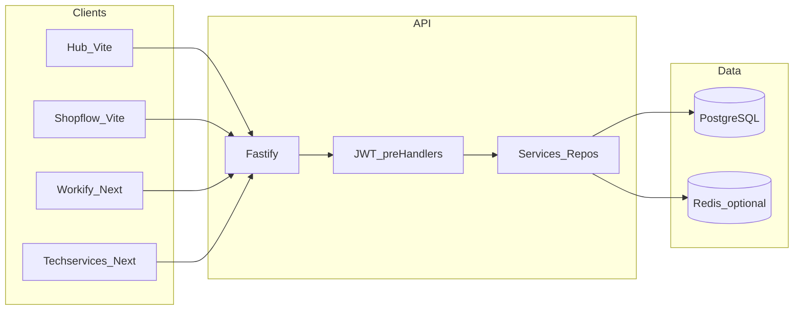
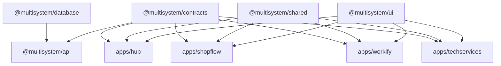
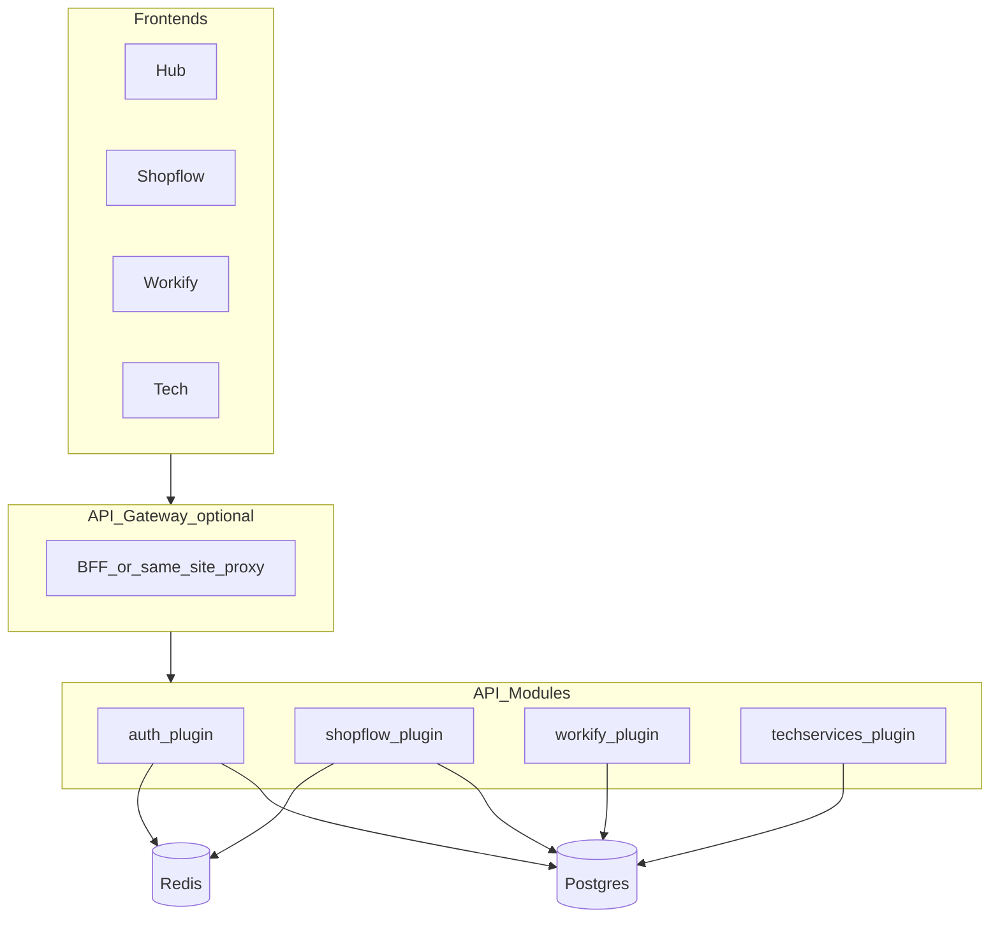

# Engineering Audit & Architecture Report

**Repository:** multisystem  
**Stack:** pnpm + Turborepo · React (Vite + Next.js) · Fastify · Prisma · PostgreSQL/Neon  
**Audit date:** 2026-03-19 (full system re-audit update)  
**Method:** Static review of `packages/api`, `packages/database`, `packages/shared`, `apps/*`; tooling: Knip (unused files), Madge (circular, API src).

---

## 1. Executive Summary

| Area | Assessment |
|------|------------|
| **Architecture quality** | **Good.** Single shared REST API with clear controller → service → repository layering, Zod validation, global error mapping, URL versioning (`/api/v1/*`), multi-tenant hooks (`requireCompanyContext`, module gating, Shopflow store scoping). |
| **Major risks** | `users` domain authorization is too broad (authenticated users can call management endpoints); tenant isolation gaps in selected Shopflow service methods; one Fastify deployable still carries all domains (blast radius, deploy coupling). |
| **Strengths** | `@multisystem/contracts`, centralized `ApiClient` + session-cookie transport in `shared`, pluginized API registration (core/domain plugins), `AppError` / `ValidationError` discipline, Vitest in API, Prisma single schema for all modules. |
| **Key recommendations** | Enforce RBAC on `/api/users*`; close tenant-isolation leaks in Shopflow service methods; standardize frontend env and auth/logout behaviors across apps; add production observability baseline (request IDs, structured logs, metrics/tracing); continue modularization by moving oversized services toward repository/policy primitives. |

---

## 2. Architecture Overview

### SPA + API model

- **Hub** (`apps/hub`) and **Shopflow** (`apps/shopflow`): Vite + React, client-side routing.
- **Workify** / **Techservices**: Next.js (ports 3003/3004 per README), can use App Router + client fetch to shared API.
- **API** (`packages/api`): Fastify on port 3000 (or serverless on Vercel). All business modules (auth, companies, shopflow, workify, techservices) mount on `/api/*`.

### Hosting model (not IIS)

- Local: Node listens `0.0.0.0`; Postgres via Docker (`docker-compose.yml`).
- Production path implied by scripts: **Vercel** for API (`VERCEL` branch), **Neon** + optional **Upstash Redis** for module cache.

### System boundaries

| Boundary | Responsibility |
|----------|------------------|
| Browser apps | UI, React Query cache, credentialed requests to API |
| `@multisystem/shared` | Session-aware `ApiClient`, auth/session helpers, prefixed module APIs |
| `@multisystem/api` | Auth, RBAC/module checks, persistence orchestration |
| `@multisystem/database` | Prisma schema, migrations, generated client |

### Data flow (Mermaid)



---

## 3. Repository Structure Map

```
multisystem/
├── apps/
│   ├── hub/                 # Portal: login, company switch, dashboard (Vite + React 19)
│   ├── shopflow/            # POS / inventory module UI (Vite)
│   ├── workify/             # HR module UI (Next.js)
│   └── techservices/        # Field service UI (Next.js)
├── packages/
│   ├── api/                 # Fastify REST API (controllers, services, repositories, DTOs)
│   ├── component-library/   # @multisystem/ui (shared React components)
│   ├── contracts/           # Shared TS types / API response shapes
│   ├── database/            # Prisma schema, migrations, generated client
│   └── shared/              # ApiClient, cookie auth (source-only workspace dep)
├── docker-compose.yml       # Local PostgreSQL
├── package.json             # turbo dev/build; vercel:build copies DB into API
├── pnpm-workspace.yaml
├── turbo.json
├── tsconfig.base.json
└── README.md
```

**Folder responsibilities**

- **`apps/*`**: Product surfaces; each may duplicate thin API wrappers unless fully on `@multisystem/shared`.
- **`packages/api`**: HTTP boundary, validation, authz, orchestration; should not own UI.
- **`packages/database`**: Single source of truth for relational model (multi-module enums/models).
- **`packages/contracts`**: Type alignment FE ↔ BE.
- **`packages/component-library`**: Design system / Radix-based primitives.

---

## 4. Dependency Graph

Workspace flow (conceptual):



**API interactions:** All apps call configured `API_URL` using shared client wrappers and `credentials: 'include'`; Bearer remains supported for scripts/tests. Shopflow adds `X-Store-Id` for store-scoped routes.

---

## 5. Request Lifecycle

1. **Browser:** User logs in or selects context → API sets httpOnly session cookie `ms_session` on API host.
2. **Subsequent requests:** Frontend uses `ApiClient` with `credentials: 'include'`; browser sends session cookie automatically.
3. **Fastify:** Global rate limit → CORS → optional URL rewrite `/api/v1/` → route `preHandler` chain:
   - `requireAuth` → decode JWT → `request.user`
   - `requireCompanyContext` / `requireShopflowContext` → resolve `companyId`, `membershipRole`, optional `storeId`
   - `requireModuleAccess('shopflow' | …)` → Redis/DB module flags
4. **Controller:** Validates body/query with Zod (`validateBody` / `validateQuery`), calls service.
5. **Service / repository:** Prisma queries **must** filter by `companyId` (and store where applicable).
6. **Response:** `ok(data)` or thrown `AppError` → `globalErrorHandler` → JSON `{ success, error, code }`.

### Re-audit delta (2026-03-19)

- Previous assumption of JS-readable cookie (`token`) is now outdated for runtime behavior; session is API-managed via `ms_session`.
- Bearer support remains as compatibility path for non-browser clients, creating mixed-mode auth surface that should stay explicitly documented.
- Cross-app consistency is still partial: apps share API client foundations, but several direct `fetch` calls bypass shared wrappers.

---

## 6. Frontend Audit (React / Vite / Next)

| Topic | Finding |
|-------|---------|
| **Component design** | Hub uses feature hooks (`useUser`, `useCompanies`, …) + React Query — reasonable separation. |
| **Composables / hooks** | Data access concentrated in hooks; good for testability. |
| **State management** | Server state via TanStack Query; local UI state in components (expected). |
| **API integration** | All apps consume shared `ApiClient`; remaining drift is wrapper duplication and direct `fetch` bypasses in feature-specific flows (uploads, printing, exports). |
| **Reactivity** | Standard React 19 + Query; no red flags from sampled hub code. |

**Detected issues**

- **Wrapper duplication** remains across app-local API modules (same shape, different files), increasing maintenance burden.
- **Mixed framework artifacts** in Hub/Shopflow (Vite active + Next-style trees/legacy files) increase onboarding/debug cost.
- **Hardcoded cross-app URLs** in Hub dashboard/landing paths create environment coupling and incorrect module routing risk.
- **Env convention drift** (`VITE_*` and `NEXT_PUBLIC_*` mixed) creates build/runtime ambiguity.

---

## 7. Backend Audit (Fastify)

| Layer | Evaluation |
|-------|------------|
| **Controllers** | Thin: validate → delegate to service → `ok()`. Auth routes use explicit checks (e.g. session userId). **Good.** |
| **Services** | Orchestration is substantial, but several services are oversized and mix domain + transport concerns. |
| **Repositories** | Repository layer exists but adoption is uneven; many services still query Prisma directly. |
| **DTOs** | Zod schemas in `dto/*.dto.ts`; separation from transport. |
| **Middleware / hooks** | `requireAuth`, context resolvers, module gate; **global** error handler single place for HTTP mapping. |
| **DI** | Module-level imports (no IoC container); acceptable for this codebase size. |

**Gaps**

- `users` endpoints are guarded by `requireAuth` only; missing stronger authorization checks for management operations.
- Shopflow service methods contain tenant-scope edge cases (`companyId` null/global config and unscoped customer lookup paths).
- Observability remains logger-only baseline; no metrics/tracing instrumentation for production diagnostics.

---

## 8. Code Quality Analysis

| Dimension | Notes |
|-----------|--------|
| **Readability** | Mixed Spanish (user messages, logs) and English (identifiers); consistent enough. |
| **Naming** | Controllers/services named by domain (`shopflow-sales.service`, etc.). |
| **Complexity** | `auth-context.ts` company resolution is long but linear; candidate for smaller pure functions. |
| **Consistency** | API responses shaped around `success` + `data` / `error`; matches contracts direction. |
| **Modularity** | API plugin modularization improved boundaries; service/repository boundary consistency remains uneven. |

**Smells:** Deep branching in tenant resolution; oversized domain services; repeated auth/logout and API-wrapper patterns across frontend apps.

---

## 9. Dead Code & Waste Analysis

Previous Knip noise finding was partially addressed with per-app `knip.jsonc` and root task wiring. Results are now more actionable, but legacy/dual-tree artifacts in Hub and Shopflow still inflate potential dead-code surface.

**Actionable waste**

- **Legacy app trees** (`shopflow/src/app-dead`, parallel Next-style directories in Hub) remain structural waste and cognitive load.
- **Thin wrapper duplication** in app API modules and logout/session helpers should be consolidated into shared utilities.

**Recommendation:** Keep per-app Knip configs synchronized with active entrypoints and remove/archive legacy trees to reduce false positives permanently.

---

## 10. Circular Dependency Detection

**Madge** on `packages/api/src` reported **54 circular dependencies**. On inspection, cycles are dominated by **Prisma generated client** (`dist/generated/prisma/internal/*` ↔ `models/*`). This is **generator-internal**, not application layering debt.

**Application-layer cycles:** No separate madge run isolated controllers-only in-repo (madge not installed as devDependency). **Manual expectation:** controllers → services → repositories → db should remain acyclic; avoid services importing controllers.

**Impact of Prisma “cycles”:** None at runtime; tooling noise only.

---

## 11. Security Audit

| Topic | Severity | Finding |
|-------|----------|---------|
| **AuthZ on users endpoints** | **High** | `/api/users*` currently requires authentication but lacks stronger role/policy checks for management operations. |
| **Tenant isolation edge cases** | **High** | Selected Shopflow service paths can operate with weak/implicit tenant scope in ways that risk cross-tenant data exposure. |
| **JWT/session transport** | **Low (improved)** | Runtime moved to httpOnly `ms_session`; Bearer remains compatibility mode and should stay constrained/documented. |
| **JWT_SECRET empty in non-production** | **Medium** | Dev default still weak by design; production enforcement exists. |
| **CORS** | **Low (improved)** | Default origins include `3001-3004`; remaining risk is env drift across docs/examples. |
| **Input validation** | **Low (good)** | Zod on controllers; Fastify schema strip for Ajv. |
| **AuthZ** | **Low (good)** | Company + module + store checks on sensitive routes. |
| **Rate limiting** | **Low (improved)** | Dedicated auth-public limiter exists; distributed deployments still need shared store validation under scale. |
| **Swagger** | **Info** | Production gating exists; keep non-prod exposure aligned with environment policy. |

---

## 12. Performance Audit

**Frontend**

- React Query `staleTime` on hub user query (5 min) reduces chatter.
- Risk: large lists without virtualization in POS/report screens (not verified per screen).
- Multiple apps = multiple bundles; shared `@multisystem/ui` helps dedupe if tree-shaken.

**Backend**

- **`getCompanyModulesForMany`**: batches module lookup — avoids N+1 on company lists.
- **Redis cache** on per-company module map (5 min TTL).
- **Risk:** Some heavy reporting/aggregation paths still perform large in-memory operations and may degrade at larger tenant sizes.
- **Payloads:** Export/report endpoints may return large JSON — add streaming or job queue if growth continues.

---

## 13. Scalability Assessment

| Dimension | Assessment |
|-----------|------------|
| **API horizontal scale** | Stateless JWT + external DB/Redis → scale-out friendly. |
| **DB** | Single Postgres; large tenants may need partitioning/read replicas later. |
| **Frontend** | Four apps = four deployables; acceptable; shared API is single bottleneck for backend changes. |
| **Coupling** | Pluginized internals improved, but one deployable API still couples release cadence and blast radius across all domains. |

---

## 14. Technical Debt Report

### Critical

- **Authorization scope gaps on user-management APIs** (`/api/users*`) allow broad operations with authentication-only protection.
- **Tenant isolation edge cases** in Shopflow service methods require stricter company-scoped enforcement.

### High

- **Service/repository boundary drift** (extensive direct Prisma usage in services) weakens clean architecture goals and policy centralization.
- **Cross-app env/auth behavior drift** (mixed env conventions, repeated auth/logout implementations, direct fetch bypasses).

### Medium

- **Observability gap** beyond baseline logging (no first-class tracing/metrics pipeline in API runtime).
- **Monorepo task inconsistency** (`typecheck` vs `type-check`, script/pipeline drift).
- **Legacy/dual-tree frontend structure** in Hub/Shopflow complicates ownership and dead-code management.

### Low

- Mixed ES/EN strings.
- `stripExamples` hook mutates route schema at runtime (maintenance oddity but documented).

---

## 15. Engineering Score (0–10)

| Dimension | Score | Justification |
|-----------|-------|----------------|
| **Architecture** | **7.8** (**+0.3**) | Pluginized API composition improved structure; boundary leaks in service/repository usage still cap score. |
| **Code quality** | **7.2** (**+0.2**) | Better modular registration and plan execution, but large service files and frontend duplication remain. |
| **Security** | **7.3** (**+0.8**) | Session-cookie hardening and CORS/rate-limit improvements raised baseline; unresolved authz/tenant gaps prevent higher score. |
| **Performance** | **7.1** (**+0.1**) | Pagination/capping progress exists; heavy report/export paths and UI list strategy still need profiling/optimization. |
| **Scalability** | **7.1** (**+0.1**) | Stateless API + plugin boundaries help operations; single deployable API and shared bottlenecks remain. |
| **Maintainability** | **7.4** (**+0.4**) | Plans A/B/D/E materially improved maintainability; cross-app wrapper/env drift and legacy trees still create friction. |

---

## 16. Risk Assessment

| Horizon | Risks |
|---------|--------|
| **Short-term** | Unauthorized user-management actions and tenant-scope edge cases in Shopflow services; frontend env drift causing incorrect runtime targets. |
| **Long-term** | API bundle growth and service sprawl; release/deploy coupling across all business modules; documentation drift versus runtime behavior. |
| **Production** | Limited telemetry for incident triage; Redis/network degradation can increase latency and obscure root-cause without richer instrumentation. |

---

## 17. Recommended Refactors (index)

Themes map to **§19** and to working plans in **`docs/plans/`** ([index](plans/README.md)).

| # | Theme | Plan | Doc |
|---|--------|------|-----|
| 1 | Token / session exposure | [completed] Plan 1 — Security & auth hardening | [\[completed\] PLAN-1-security-auth-hardening.md](plans/[completed]%20PLAN-1-security-auth-hardening.md) |
| 2 | CORS / dev origins | [completed] Plan 2 — CORS & environment alignment | [\[completed\] PLAN-2-cors-environment.md](plans/[completed]%20PLAN-2-cors-environment.md) |
| 3 | Duplicate HTTP clients | Plan 3 — Unify ApiClient | [PLAN-3-unify-apiclient.md](plans/PLAN-3-unify-apiclient.md) |
| 4 | Knip noise / dead code | [completed] Plan 4 — Tooling & dead-code hygiene | [\[completed\] PLAN-4-tooling-dead-code.md](plans/[completed]%20PLAN-4-tooling-dead-code.md) |
| 5 | Auth brute-force / abuse | [completed] Plan 1 (rate limits) | [\[completed\] PLAN-1-security-auth-hardening.md](plans/[completed]%20PLAN-1-security-auth-hardening.md) |
| 6 | Monolithic API growth | [completed] Plan 5 — API modularization (optional) | [\[completed\] PLAN-5-api-modularization.md](plans/[completed]%20PLAN-5-api-modularization.md) |
| 7 | FE perf / BE payloads | Plan 6 — Performance follow-ups | [PLAN-6-performance-followups.md](plans/PLAN-6-performance-followups.md) |

Execution tracking note (current cycle): recommended sequencing was `2 -> 1`, but implemented sequencing completed as `1 -> 2` with stable post-alignment behavior.

---

## 18. Ideal target architecture

- **BFF optional:** Next apps could proxy API under same site to simplify cookies/CORS.
- **Packages:** `api-auth`, `api-shopflow`, `api-workify` as Fastify plugins registered from one entry (or separate deployables later).
- **Frontends:** Single `api-sdk` package generated from OpenAPI or built on `contracts` + shared fetch wrapper.



---

## 19. Implementation plans (separated)

**Authoritative task checklists** live under **`docs/plans/`**: [README](plans/README.md). **Sync rule:** update checkboxes in the same change set as the implementation — see [plans/SYNC.md](plans/SYNC.md).

| Plan | File |
|------|------|
| [completed] 1 — Security & auth | [plans/[completed] PLAN-1-security-auth-hardening.md](plans/[completed]%20PLAN-1-security-auth-hardening.md) |
| [completed] 2 — CORS & environment | [plans/[completed] PLAN-2-cors-environment.md](plans/[completed]%20PLAN-2-cors-environment.md) |
| 3 — Unify ApiClient | [plans/PLAN-3-unify-apiclient.md](plans/PLAN-3-unify-apiclient.md) |
| [completed] 4 — Tooling & dead code | [plans/[completed] PLAN-4-tooling-dead-code.md](plans/[completed]%20PLAN-4-tooling-dead-code.md) |
| [completed] 5 — API modularization (optional) | [plans/[completed] PLAN-5-api-modularization.md](plans/[completed]%20PLAN-5-api-modularization.md) |
| 6 — Performance follow-ups | [plans/PLAN-6-performance-followups.md](plans/PLAN-6-performance-followups.md) |

**Suggested order (historical recommendation):** **2** → **1** → **3** + **4** in parallel → **6** ongoing → **5** when justified.

**Execution status (current repo):**
- Completed in practice: `1 -> 2` (both done).
- Completed: `4` and `5`.
- Effective remaining focus: `3 + 4` parallel track context (with `4` already closed), then `6` ongoing.
- `3` optional documentation follow-through (`api-sdk`/OpenAPI path note) is now documented in the plan; remaining work is wrapper consistency cleanup when prioritized.

---

## 20. Continuous update instructions

When new files or folders are provided:

1. **Re-scan** affected packages (`api`, `apps/*`, `database`) and update **§2–5** if boundaries or flows change.
2. **Append** new findings to **§6–14** with date stamp; **do not remove** prior history—strike through or move superseded items to an “Archive” subsection if needed.
3. **Revise Mermaid** diagrams in **§2, §4, §18** when new services or apps appear.
4. **Adjust §15 scores** with one-line delta note (e.g. “+0.5 Security after httpOnly migration”).
5. Re-run **Knip** / **Madge** after config changes and refresh **§9–10**.
6. **Plans:** Follow [docs/plans/SYNC.md](plans/SYNC.md) — on any change that completes a plan task, **check the matching `[x]`** in `docs/plans/*.md` in the same PR; keep audit §17–§19 as links only (no duplicate task lists). Update §17/§19 if plan IDs or filenames change.
7. Keep this file as the **single** living audit document at `docs/ENGINEERING_AUDIT_REPORT.md`.

---

## 21. Full System Re-Audit Findings (2026-03-19)

### 21.1 Baseline finding reclassification

| Previous finding | Status | Re-audit result |
|---|---|---|
| JWT in JS-readable cookie is high risk | **Resolved / reclassified** | Runtime session model now uses httpOnly `ms_session`; this finding is archived as historical. |
| CORS default may omit hub (`3001`) | **Resolved / reclassified** | API defaults include `3001-3004`; current risk is documentation/env drift, not missing baseline origins. |
| Duplicate app-local ApiClient classes | **Partially resolved** | Core client class duplication is removed; thin wrapper duplication and direct `fetch` bypasses remain. |
| API modularization pending | **Resolved (structural)** | Pluginized API registration is implemented; deploy model is still a single service. |
| Knip results mostly noisy due to missing config | **Improved** | Per-app Knip configs exist; remaining noise is now tied to legacy trees and mixed app structure. |

### 21.2 Cross-App Consistency

- **API client foundation:** consistent adoption of `@multisystem/shared` wrappers across Hub, Shopflow, Workify, and Techservices.
- **Auth/logout behavior:** inconsistent implementation details remain (manual cookie clearing patterns vs shared helper usage).
- **Direct fetch bypasses:** selected features (uploads, printing, exports) bypass shared API wrapper standards, fragmenting retries/error handling contracts.
- **Environment contract drift:** mixed `VITE_*` and `NEXT_PUBLIC_*` usage in frontend apps increases integration mistakes and build ambiguity.
- **Documentation drift:** multiple app READMEs still describe `token` cookie even though runtime moved to `ms_session`.

### 21.3 Architecture Integrity

- **Positive:** API modularization via plugin registration improved separation of concerns at startup/wiring level.
- **System leak:** service layer still frequently accesses Prisma directly, underusing repository abstractions and weakening policy centralization.
- **Hidden coupling:** Hub contains hardcoded cross-app URLs and duplicate dashboard route logic in parallel trees.
- **Deploy coupling:** despite plugin boundaries, all modules ship together in one API deployable, retaining shared blast radius.

### 21.4 Clean Architecture Compliance

- **Dependency direction:** controllers mostly delegate correctly; services often depend on persistence details directly (`prisma.*`), bypassing repository interfaces.
- **Layer leakage:** selected services return transport-shaped payloads (`success/data`), coupling domain logic to HTTP response conventions.
- **Boundary ambiguity:** frontend apps contain mixed framework artifacts (active Vite with residual Next-oriented structures).

### 21.5 SOLID (Global)

- **SRP violations:** oversized domain services (notably Shopflow aggregate service) combine multiple bounded contexts.
- **DIP violations:** domain logic depends on concrete Prisma client in many services rather than repository abstractions.
- **OCP pressure:** authorization and tenant checks are repeated across services instead of centralized policy primitives.
- **ISP/LSP risk:** inconsistent service return contracts increase conditional handling and reduce substitutability.

### 21.6 Systemic Risks

- **Monorepo operational complexity:** mixed frontend frameworks and env conventions increase integration/testing overhead.
- **Shared package bottlenecks:** one API package and one DB schema drive all domains, making coordinated changes expensive.
- **Deployment coupling:** single API service ties release cadence and rollback risk across independent business modules.
- **Versioning/change management risk:** internal `workspace:*` usage is efficient, but change provenance and docs synchronization remain fragile.

### 21.7 Developer Experience (DX)

- **Onboarding friction:** dual-tree/legacy structures in Hub and Shopflow obscure canonical app entry points.
- **Tooling inconsistency:** lint/typecheck scripts and task names differ across apps/packages, reducing monorepo uniformity.
- **Config overhead:** env examples contain duplicated/mixed variables that do not cleanly match each app runtime model.

### 21.8 Observability

- **Current baseline:** Fastify logging and global error mapping are present.
- **Primary gap:** no first-class metrics/tracing pipeline detected in API runtime; production diagnosis relies mainly on logs.
- **Health endpoint depth:** health route is shallow and does not validate dependency readiness beyond process liveness.
- **Recommendation:** add minimally invasive observability baseline (request IDs/correlation, domain-level structured events, dependency health checks, and metrics export path).

## 22. Cross-System Issues (prioritized)

| Priority | Severity | Issue | Affected areas | System impact | Recommended fix path |
|---|---|---|---|---|---|
| 1 | Critical | Missing strong authorization on `/api/users*` | `packages/api` users controller/service | Privilege abuse risk across tenants/companies | Add role/policy guards + company-scope checks for read/write/delete operations |
| 2 | Critical | Tenant-scope edge cases in Shopflow service methods | `packages/api` shopflow services | Potential cross-tenant data leakage and incorrect global config behavior | Enforce mandatory company-scoped queries and remove null/global config fallback patterns |
| 3 | High | Service/repository boundary drift | `packages/api` services | Harder testing, duplicated access rules, architecture erosion | Incrementally migrate high-risk service queries behind repositories/policy helpers |
| 4 | High | Cross-app env/auth implementation drift | `apps/*`, docs | Runtime misconfiguration, inconsistent behavior, support overhead | Standardize env contract and shared auth/logout helpers; align app docs with runtime |
| 5 | Medium | Single API deployable coupling | `packages/api`, CI/CD | Shared blast radius and release lockstep across domains | Keep plugin modules but introduce stricter domain ownership and staged deploy controls |
| 6 | Medium | Observability gaps | `packages/api` runtime/ops | Slower incident diagnosis and capacity planning | Add tracing/metrics + enriched health/readiness checks |
| 7 | Medium | Legacy frontend trees and duplicated wrappers | `apps/hub`, `apps/shopflow` | Onboarding friction and dead-code growth | Decommission legacy trees, consolidate wrappers, enforce canonical app architecture |

## 23. Refactor Plan Update (execution order refresh)

### Immediate (risk containment)

1. Apply strict authorization policy to `/api/users*` (role + company scope).
2. Close tenant-scope gaps in Shopflow services and add regression tests for cross-tenant access.
3. Align all app docs and env examples with `ms_session` + `credentials: 'include'` runtime.

### Near-term (architecture consistency)

4. Standardize frontend env contract per framework (`VITE_*` for Vite, `NEXT_PUBLIC_*` for Next) and remove mixed-mode fallbacks.
5. Consolidate repeated auth/logout and thin API wrapper patterns into shared utilities.
6. Start service-to-repository migration for highest-risk domains (users + shopflow sales/config/report paths).

### Mid-term (platform hardening)

7. Add production observability baseline (structured events, metrics/tracing, dependency-ready health checks).
8. Reduce deploy coupling with domain ownership boundaries and safer rollout controls while retaining plugin architecture.
9. Remove/archive legacy frontend trees and lock canonical entrypoints/tooling conventions.

### Plan alignment (1-6)

- **[completed] 1/2/4/5:** completed and validated as materially beneficial.
- **3:** functionally improved; remaining work is wrapper/doc consistency and optional SDK/documentation follow-through.
- **6:** remains active; prioritize backend heavy-path profiling + frontend large-list rendering strategy.

---

*End of report (extended full re-audit). Preserve prior findings and keep updating deltas in-place.*
