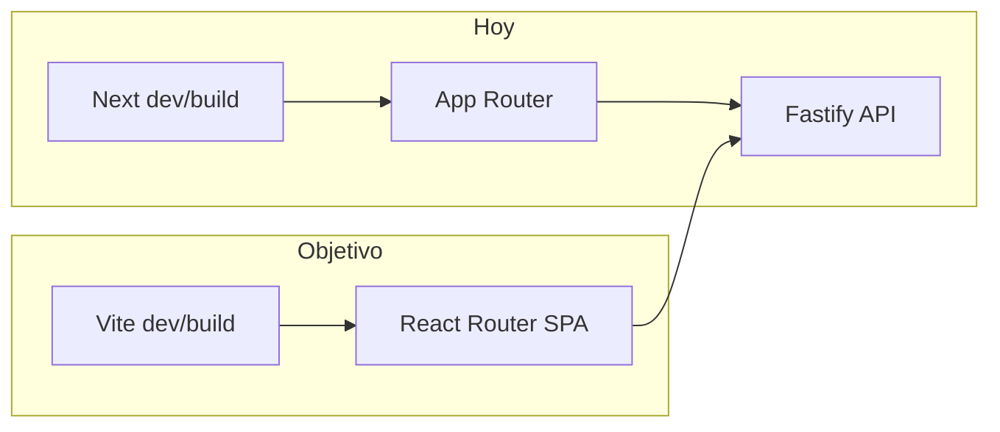

# PLAN-29 — Migrar Workify de Next.js a Vite

**Estado:** pendiente de ejecución.

## Objetivo

Reemplazar **Next.js 16 (App Router)** en `apps/workify` por **Vite + React + React Router**, alineado con **Shopflow** y el **Hub**: SPA que habla solo con la API Fastify (`/api/workify/*`, `/api/auth/*`), cookie JWT y mismos paquetes workspace. Mismo puerto de desarrollo (**3003**) salvo que se decida lo contrario en implementación.

## Contexto y precedentes

- **Shopflow** ya migró de Next a Vite con objetivo *serverless-friendly* y cliente unificado — ver [PLAN-16 — Shopflow Serverless + API Alignment](./[completed]%20PLAN-16-shopflow-serverless-api-alignment.md).
- **Workify** hoy: `src/app/**` (rutas y layouts), `next/link`, `next/navigation`, `next/font/google`, metadata/viewport en `layout.tsx`, iconos dinámicos (`next/og`). El README raíz lista Workify como Next; tras el plan habrá que actualizar [README.md](../../README.md), [apps/workify/README.md](../../apps/workify/README.md) y referencias (`NEXT_PUBLIC_*` → `VITE_*` donde aplique).

## Decisiones (propuestas)

1. **Enrutamiento:** `react-router-dom` v7 (como Shopflow): `BrowserRouter`, rutas públicas (`/`, `/login`, `/register`), layout protegido con sidebar para el árbol actual bajo `(dashboard)`.
2. **Variables de entorno:** `VITE_API_URL` (y el resto de URLs públicas) en línea con Hub/Shopflow; deprecar `NEXT_PUBLIC_*` en Workify.
3. **SEO / metadata:** título y meta en `index.html` base + actualización opcional del `<title>` por ruta (`react-helmet-async` o patrón mínimo tipo Shopflow — confirmar en implementación según lo que ya use el repo).
4. **Fuentes:** sustituir `next/font/google` (Geist) por CSS (`@import` o archivos locales) para no depender del bundler de Next.
5. **Favicon / iconos:** sustituir `icon.tsx` / `apple-icon.tsx` basados en `ImageResponse` por assets estáticos en `public/` (o equivalente Vite).
6. **Guardrails:** regla ESLint `no-restricted-imports` para `next` y `next/*` en `apps/workify` (como PLAN-16 en Shopflow).
7. **Código server-only de Next:** `getCurrentUser` / `requireAuth` en [`apps/workify/src/lib/auth.ts`](../../apps/workify/src/lib/auth.ts) usan `next/headers` y **no aparecen referenciados fuera del propio archivo** — eliminar o sustituir por comprobación solo vía API en cliente; revisar utilidades con `NextRequest` (`rateLimit`, `security*`) y **portar a `Request` estándar o eliminar** si quedan huérfanas.

## Enfoque técnico (resumen)

| Área | Acción |
|------|--------|
| Entrada | `index.html` en raíz de `apps/workify`, `src/main.tsx`, `src/App.tsx` con árbol de rutas. |
| Migración de páginas | Cada `src/app/**/page.tsx` → vista o página bajo `src/views/` o `src/pages/` (convención a alinear con Shopflow: `views/` + `PageFrame` si aplica). |
| Layouts | `RootLayout` → shell en `App` + providers existentes (`QueryProvider`, `ServiceInitializer`); `(auth)/layout` y `(dashboard)/layout` → `Outlet` + componentes de layout. |
| Links / navegación | `next/link` → `react-router-dom` `Link` (`to=`); `usePathname` / `useRouter` / `useParams` → hooks de React Router. |
| Proxy dev | `vite.config.ts`: proxy `/api` (y `/v1` si se usa) hacia `localhost:3000` — espejo de [apps/shopflow/vite.config.ts](../../apps/shopflow/vite.config.ts). |
| Monorepo | Alias `@` → `src`; alias `@multisystem/ui` como en Shopflow; `package.json`: quitar `next`, `eslint-config-next`; añadir `vite`, `@vitejs/plugin-react`, `react-router-dom`. |
| Build / CI | `pnpm build` → `vite build`; actualizar `turbo.json` / scripts raíz si filtran `@multisystem/workify`; `vercel.json` o docs de deploy: **static output** (preview `vite preview` o hosting de `dist/`). |
| Tests | Mantener Vitest; ajustar paths y mocks si importaban Next. |

## Diagrama de alto nivel

## Checklist

- [ ] Scaffold Vite en `apps/workify` (config, `index.html`, TS env `ImportMetaEnv` para `VITE_*`).
- [ ] Árbol de rutas equivalente a todas las rutas actuales bajo `src/app/` (incl. dinámicas `employees/[id]/...`).
- [ ] Migrar estilos globales (`globals.css` → import en entrada).
- [ ] Reemplazar todas las importaciones `next/*` en `src/`; añadir ESLint restricted imports.
- [ ] Actualizar [`apps/workify/src/lib/api/client.ts`](../../apps/workify/src/lib/api/client.ts) y [`landingUrls.ts`](../../apps/workify/src/lib/landingUrls.ts) a variables `VITE_*`.
- [ ] Limpiar `auth.ts` (server headers) y utilidades solo Next.
- [ ] Eliminar `next.config.ts`, `next-env.d.ts`, directorio `src/app/` tras mover código.
- [ ] Actualizar `.env.example`, README Workify, README raíz, referencias en Hub/Techservices/Shopflow `.env.example` si cambian nombres de variables.
- [ ] `pnpm --filter @multisystem/workify lint`, `typecheck`, `build`, `test`.
- [ ] Revisión manual: login, dashboard, rutas de empleados con `id`, landing `/`, enlaces entre apps (puerto 3003).

## Referencias

- Patrón objetivo: [`apps/shopflow/src/App.tsx`](../../apps/shopflow/src/App.tsx), [`apps/shopflow/vite.config.ts`](../../apps/shopflow/vite.config.ts).
- Plan histórico Shopflow: [PLAN-16](./[completed]%20PLAN-16-shopflow-serverless-api-alignment.md).
- Rutas lógicas: [`apps/workify/src/lib/constants/routes.ts`](../../apps/workify/src/lib/constants/routes.ts).

## Riesgos

- **Regresiones de ruta:** errores en rutas dinámicas o redirects; mitigar con checklist manual y pruebas de navegación.
- **Deploy:** proyectos Vercel que esperan `next build` deben pasar a **Vite** (framework preset static o comando custom); coordinar con quien mantenga el pipeline.
- **Paridad visual:** fuentes y meta OG pueden diferir ligeramente hasta afinar `index.html` y assets.
