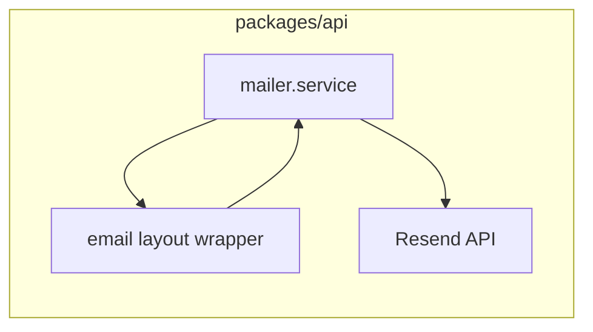

# PLAN-41 — Layout de correos transaccionales (marca Hub)

**Estado:** pendiente (documentación de plan + implementación vía SDD).

## Objetivo

Definir e implementar un **contenedor visual único** para los correos transaccionales enviados por la API que **evoca** la estética del landing y del auth “brand” del Hub, **sin** depender de Tailwind ni de assets de runtime en el HTML: solo **tablas + estilos inline** (y subset compatible con clientes de correo restrictivos).

Referencia de marca alineada a **[PLAN-27 — AuthLayout brand + identidad Hub](./%5Bcompleted%5D%20PLAN-27-auth-layout-brand-identity.md)** y al Hero del Hub.

## Referencia visual (código fuente)

| Elemento | Referencia en repo |
|----------|-------------------|
| Landing / fondo / CTAs | [`apps/hub/src/components/Hero.tsx`](../apps/hub/src/components/Hero.tsx), [`apps/hub/src/views/LandingPage.tsx`](../apps/hub/src/views/LandingPage.tsx) |
| Auth brand | [`packages/component-library/src/components/auth-layout.tsx`](../packages/component-library/src/components/auth-layout.tsx) |

### Tokens a reflejar en el correo (con matices email-safe)

- **Fondo principal:** `#0a0a0f` (igual que Hero / landing).
- **Acentos:** índigo / violeta coherentes con el Hero (p. ej. rejilla `rgba(99,102,241,…)` como **textura muy sutil** en header o borde; **sin** `backdrop-blur`).
- **Título / énfasis:** degradado tipo Hero (`#818cf8` → `#a78bfa` → `#6366f1`) **solo** si hay fallback aceptable para clientes que no pintan `background-clip` en texto; si no, **color sólido** `#818cf8` o `#a78bfa`.
- **CTA (botón primario):** cercano al Hero — fondo tipo `indigo-600` (`#4f46e5` o equivalente), texto blanco, bordes redondeados (~12px), `box-shadow` inline suave opcional (`rgba(99,102,241,0.35)`).
- **Tipografía:** pila segura: `-apple-system, BlinkMacSystemFont, "Segoe UI", Roboto, Helvetica, Arial, sans-serif`.
- **Texto secundario:** blanco con opacidad aproximada a `white/50`–`white/60` en equivalente hex/rgba sobre fondo oscuro, manteniendo **contraste WCAG** razonable.

## Alcance funcional (correos actuales)

Implementación posterior debe cubrir las rutas ya expuestas en [`packages/api/src/services/mailer.service.ts`](../packages/api/src/services/mailer.service.ts):

- `sendRegistrationOtpEmail`
- `sendRegistrationMagicLinkEmail`
- `sendEmailVerificationLink`

El transporte sigue siendo **Resend**; este plan solo afecta **asunto** (si se ajusta copy) y sobre todo **HTML** + **texto plano** ya generado por `sendMail`.

## Restricciones HTML para clientes de correo

- Contenedor principal ~**600px** de ancho, maquetación basada en **tablas**.
- Estilos **inline** predominantes; evitar **flex/grid** como layout principal.
- No usar `backdrop-blur`, animaciones complejas ni dependencias de efectos que el Hero sí usa en web.
- Probar en al menos un cliente **restrictivo** (p. ej. Outlook) como criterio de aceptación.
- **Accesibilidad:** contraste en cuerpo y CTA; enlace con **texto descriptivo**; el `text:` de `sendMail` debe seguir incluyendo la URL explícita donde aplique.

## Configuración opcional (mejora)

- Variable de entorno opcional **`MAIL_BRAND_LOGO_URL`** (URL HTTPS pública a logo) para un header de marca; no requerida para la v1 del layout.

## Proceso: SDD (Spec-Driven Development)

Cualquier **implementación** que cambie el HTML/texto visible de estos correos debe seguir el flujo **SDD** del repositorio ([`openspec/`](../openspec/), [`openspec/config.yaml`](../openspec/config.yaml)): exploración, propuesta, especificación, diseño, tareas, apply, verify, archive según convención del proyecto.

## Diseño UX/UI: skill **ui-ux-pro-max**

En las fases **explore / design / spec** del cambio bajo `openspec/`, **leer y aplicar** el skill **ui-ux-pro-max** (puede estar solo en el entorno Cursor del desarrollador; no está versionado actualmente bajo [`.cursor/skills/`](../.cursor/skills/) junto al resto de skills del monorepo).

Uso esperado: **paleta, jerarquía tipográfica, espaciado, estados del CTA y accesibilidad**, interpretados en **HTML transaccional** (sin Tailwind en el correo, sin efectos web-only).

## MCP (opcional)

MCP no es obligatorio. Si hay servidor útil (p. ej. referencia de componentes tipo **shadcn/ui**), usarlo solo como **guía de proporciones o estilo**, sin copiar JSX/React al HTML del correo.

## Dirección técnica recomendada (implementación)

- Un único **wrapper de layout** (p. ej. `email-layout.ts` junto al mailer o bajo `packages/api/src/services/email-templates/`) con parámetros del estilo: `title`, `previewText` opcional, `bodyHtml`, `cta?: { label, href }`.
- **Mantener** la firma de `sendMail` (`text` + `html` opcional); las funciones específicas construyen `html` vía el wrapper.
- **Decisión en `design.md` (openspec):** plantillas **TypeScript + strings** (ligero) frente a **React Email** (mejor DX, más dependencias/build).

## Diagrama (alto nivel)

## Checklist

- [x] Cambio SDD abierto bajo `openspec/changes/…` con spec + design (incl. decisión TS strings vs React Email).
- [x] Wrapper de layout único con tokens marca Hub (email-safe).
- [x] `sendRegistrationOtpEmail`, `sendRegistrationMagicLinkEmail`, `sendEmailVerificationLink` usan el layout (HTML); texto plano coherente.
- [x] Vista previa local o fixture de HTML para los tres tipos de correo (`packages/api/src/services/email-templates/fixtures/README.md`).
- [ ] Prueba visual o manual en al menos un cliente restrictivo (p. ej. Outlook).
- [x] Tests existentes que mockean envío siguen pasando; opcional: aserción sobre fragmento HTML (CTA, `href`).
- [ ] Verify SDD y cierre según [`openspec/config.yaml`](../openspec/config.yaml) (archivado `openspec/changes/archive/` cuando el PR mergee).

## Referencias relacionadas

- [PLAN-39 — Registro OTP + Resend](./%5Bcompleted%5D%20PLAN-39-company-registration-otp.md)
- [PLAN-40 — Magic link](./%5Bcompleted%5D%20PLAN-40-registration-magic-link.md)
- [`packages/api/src/services/mailer.service.ts`](../packages/api/src/services/mailer.service.ts)
