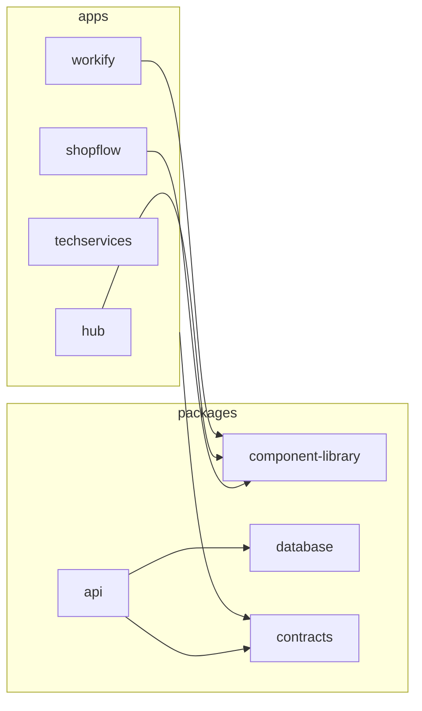

# PLAN-31 — Shopflow: migración a Next.js y sincronización de dependencias del monorepo

**Estado:** completado.

## Objetivo

1. Sustituir **Vite + React Router** en `apps/shopflow` por **Next.js 16 (App Router)**, consumiendo la misma API (`@multisystem/api`) por HTTP, con variables `NEXT_PUBLIC_*` en cliente.
2. **Sincronizar dependencias** en **todo el monorepo**: workspaces en `apps/*` y `packages/*` (API, database, contracts, shared, component-library, etc.) con versiones alineadas de herramientas y librerías compartidas (`typescript`, `zod`, `vitest`, `prisma` / `@prisma/client`, stack React/Next/Tailwind en apps, etc.). Sustituir bundlers (p. ej. Vite en la librería UI) es opcional; **coherencia de versiones no**.

## Beneficios esperados

- Paridad con Hub/Workify/Techservices (Next, rutas HTTP, despliegue Vercel).
- Un solo contrato de versiones entre apps y packages; menos sorpresas en CI y en local.
- Catálogo pnpm opcional en la raíz para reducir deriva futura.

## Estado actual del monorepo

| Ubicación | Stack | Nota |
|-----------|--------|------|
| `apps/hub` | Next.js 16 | Completado ([PLAN-29](./%5Bcompleted%5D%20PLAN-29-hub-next-migration.md)) |
| `apps/workify` | Next.js 16 + Tailwind 4 | Referencia principal para Shopflow |
| `apps/techservices` | Next.js | Ya migrado |
| `apps/shopflow` | Next.js 16 (App Router) | Migrado desde Vite + React Router (este plan). |
| `packages/component-library` (`@multisystem/ui`) | Vite como build de librería (`dist/`) | Sincronizar con apps (React, TS, Vitest/Vite, Radix, …) |
| `packages/api` | Fastify, Vitest, Prisma adapters | Sincronizar `typescript`, `vitest`, `@prisma/client` con `packages/database`; **Zod v3** hoy vs **v4 en apps** — ver política abajo |
| `packages/database` | Prisma, `tsx` | Alineación de `prisma`, `typescript`, `tsx` con API |
| `packages/contracts` | `tsc` | Misma `typescript` que el resto |
| `packages/shared` | Código compartido (exports TS) | Sin deps propias hoy; cualquier devDep añadida debe seguir el catálogo |

## Política de versiones (`apps/*` + `packages/*`)

**Alcance:** todo workspace con `package.json` bajo `apps/` y `packages/`. Objetivo: **una sola línea de versiones** para cada dependencia que aparezca en **más de un paquete**, o que defina **contratos cruzados**.

**Frontends** (`apps/hub`, `workify`, `techservices`, `shopflow`): mismas versiones para `next`, `react`, `react-dom`, `typescript`, `zod`, `@tanstack/react-query` (donde exista), `lucide-react`, `tailwindcss` + PostCSS, `eslint-config-next`, `prettier`, `@types/*`, etc.

**`@multisystem/ui`** (`packages/component-library`): peers `react` / `react-dom` alineados con apps; `@radix-ui/*`, `clsx`, `lucide-react`; devDeps (`typescript`, `vite`, `vitest`, `@vitejs/plugin-react`, `sass`, tipos) alineadas al catálogo monorepo.

**Backend y datos:** `packages/api` y `packages/database`: `typescript`, `tsx` (si aplica), **`@prisma/client` / `prisma`** en la misma generación. **Vitest:** misma familia en API, apps y packages que lo usan.

**Zod:** API y apps en **Zod 4** (migración hecha en el marco de este plan).

**Tailwind:** apps en **v4** alineadas vía monorepo (`pnpm-workspace.yaml` catálogo + PostCSS `@tailwindcss/postcss`).

**Mecánica:** [pnpm `catalog:`](https://pnpm.io/catalogs) centralizado en `pnpm-workspace.yaml` (ver también [PLAN-34](./PLAN-34-pnpm-catalog.md)).

## Alcance

1. Migrar `apps/shopflow` a Next.js (App Router); eliminar Vite, `index.html`, `main.tsx`, `App.tsx`, `react-router-dom`; árbol de dependencias alineado al monorepo.
2. Actualizar cada `apps/*` y `packages/*` según la política (incluye Zod en API y Prisma API/database).
3. Opcional: cambiar bundler de la librería UI (Vite → tsup/rollup); no exime de alinear versiones de tooling.

## Referencias técnicas

- Estructura: `apps/workify` (`src/app/`, `@tailwindcss/postcss` + Tailwind 4 si se unifica, `paths` `@/*`, `dev` con puerto y `--turbo`).
- Next monorepo: `apps/workify/next.config.ts` — `turbopack.root`, `transpilePackages: ["@multisystem/ui"]`, headers.
- Rewrites dev API: `apps/hub/next.config.ts` (`/v1/:path*` → API); equivalente al proxy en `apps/shopflow/vite.config.ts`.
- Hub: `NEXT_PUBLIC_SHOPFLOW_URL` (`apps/hub`).

## Mapeo de rutas → `src/app/`

Rutas actuales en `apps/shopflow/src/App.tsx`.

- **Público:** `/`, `/login`, `/register`, `/terms`
- **Protegido (layout cliente):** misma jerarquía que hoy: `DashboardSessionGate` → `ShopflowModuleGuard` → `CompanyContextBootstrap` → `StoreProvider` + `Sidebar`.
- Rutas protegidas: `/dashboard`, `/pos`, `/products`, `/products/new`, `/products/[id]`, `/categories`, `/inventory`, `/inventory/low-stock`, `/inventory/adjustments`, `/reports`, `/reports/sales`, `/reports/inventory`, `/sales/[id]`, `/customers`, `/customers/new`, `/customers/[id]`, `/suppliers`, `/suppliers/new`, `/suppliers/[id]`, `/admin/users`, `/admin/users/new`, `/admin/users/[id]`, `/admin/settings`, `/admin/loyalty`, `/admin/backup`, `/account`

Sustituir `ProtectedRoute` (React Router) por layout cliente + `next/navigation`. Reemplazar `Link` / `useNavigate` / `useParams` de `react-router-dom` por `next/link` y `next/navigation`.

## Variables de entorno (Shopflow)

| Actual | Objetivo |
|--------|----------|
| `VITE_API_URL` | `NEXT_PUBLIC_API_URL` |
| `VITE_HUB_URL`, `VITE_WORKIFY_URL`, `VITE_TECHSERVICES_URL`, `VITE_SHOPFLOW_URL` | `NEXT_PUBLIC_HUB_URL`, etc. |
| `VITE_VAPID_PUBLIC_KEY` | `NEXT_PUBLIC_VAPID_PUBLIC_KEY` |

Actualizar `turbo.json` (`globalEnv`): retirar `VITE_*` obsoletos cuando no se usen.

## Otros detalles

- Puerto dev Shopflow: **3002** (`next dev -p 3002 --turbo`).
- Estilos: PostCSS/Tailwind alineado al resto de apps tras sincronización; `globals.css` desde `src/app/layout.tsx`.
- `public/` de Shopflow se conserva.
- Service worker: `usePushNotifications.ts` registra `/sw.js` — verificar `public/sw.js` o documentar.
- **Tests:** Next no sustituye el runner; mantener **Vitest** (paridad Workify) o valorar **Jest** + `next/jest`.
- Eliminar dependencias Vite de la **app** Shopflow; `build` → `next build`.

## Checklist

- [x] Sincronización monorepo: API en **Zod 4** + **Vitest 4**; Prisma alineado; **catálogo pnpm** en `pnpm-workspace.yaml`; **Tailwind 4** en Hub/Techservices y resto de apps alineadas.
- [x] Scaffold Next en `apps/shopflow`: `next.config`, `src/app/layout`, providers, puerto 3002, rewrites `/v1` en dev.
- [x] Rutas App Router (público + protegido) con paridad respecto al antiguo `App.tsx`.
- [x] Quitar React Router; migrar enlaces y params a Next.
- [x] `VITE_*` → `NEXT_PUBLIC_*`; `.env.example`; `turbo.json`.
- [x] Eliminar artefactos Vite de la app; Vitest con `vitest.config.ts` (alias `@/`); `public/sw.js` sin cambio.
- [x] Actualizar `apps/shopflow/README.md` y referencias en README raíz.
- [x] Verificación manual operativa (auth, POS, impresión, notificaciones): **checklist y registro en [PLAN-37](./PLAN-37-shopflow-manual-qa-smoke.md)** (cierre de calidad fuera del alcance de implementación PLAN-31).
- [x] Build: `shopflow` + `api` + dependencias (`contracts`, `database`, `@multisystem/ui`) vía turbo.

## Riesgos

- **Zod:** migración API v3 → v4 es sensible; requiere pruebas de DTOs y endpoints.
- **Cookies / CORS:** alineados con API y `@multisystem/shared/auth`.
- **CI/Vercel:** Shopflow debe publicar `.next`, no `dist`.

## Git

Implementación en rama `plan/plan-31-shopflow-next-migration-run-<timestamp>` desde `Test`, según [git-plan-workflow-start](../../.cursor/rules/git-plan-workflow-start.mdc).

## Seguimiento (planes canónicos derivados)

| Plan | Tema |
|------|------|
| [PLAN-32](./%5Bcompleted%5D%20PLAN-32-monorepo-dependency-alignment.md) | Alineación sistemática de dependencias en todo el monorepo |
| [PLAN-33](./PLAN-33-tailwind-v4-hub-techservices.md) | Tailwind 4 en Hub y Techservices |
| [PLAN-34](./PLAN-34-pnpm-catalog.md) | Catálogo pnpm (`catalog:`) en la raíz |
| [PLAN-35](./PLAN-35-component-library-tooling-alignment.md) | `@multisystem/ui`: tooling + bundler opcional |
| [PLAN-36](./PLAN-36-shopflow-service-worker-push.md) | Shopflow: SW / push — verificar o documentar |
| [PLAN-37](./PLAN-37-shopflow-manual-qa-smoke.md) | Shopflow: verificación manual y smoke |

## Referencias

- `apps/workify/next.config.ts`, `apps/hub/next.config.ts`
- `apps/shopflow/README.md` (actualizar tras migración)
- [PLAN-29](./%5Bcompleted%5D%20PLAN-29-hub-next-migration.md) (Hub Next)
