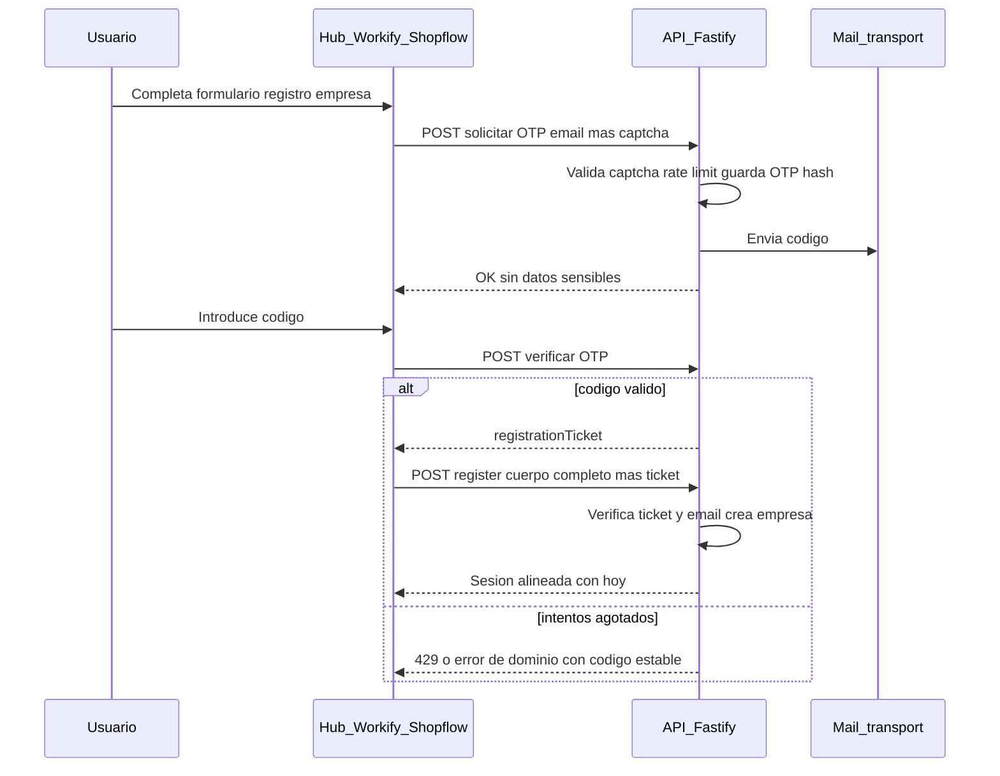

# PLAN-39 — Registro de empresas con OTP, email y captcha

**Estado:** **completado** — documento canónico único: **especificación de diseño** y **checklist de implementación** (código, tests, apps). Smoke de las tres apps validado para cierre del plan (local/staging según entorno del equipo).

**Objetivo:** Definir e implementar el flujo de **alta de empresa** con verificación de **email por OTP** antes de ejecutar el registro definitivo: envío por **SMTP u otro transporte**, **captcha** anti-abuso (recomendación: Cloudflare Turnstile, tier gratuito), **máximo 3 envíos** de código por ventana y **máximo 3 intentos** de verificación fallidos, y solo entonces **`POST /v1/auth/register`** con un **ticket de prueba** emitido tras OTP válido.

---

## 1. Contexto y estado actual

| Aspecto | Hoy |
|--------|-----|
| Registro | Un solo `POST /v1/auth/register` con [`registerBodySchema`](../../packages/api/src/dto/auth.dto.ts). |
| Servicio | [`authService.register`](../../packages/api/src/services/auth.service.ts): si viene `companyName`, crea `User` + `Company` + membresía `OWNER` + módulos en **una transacción** y devuelve JWT + cookies de sesión. |
| OTP / email | No hay OTP ni envío de correo en el camino de registro. |
| Rate limit | Rutas públicas de auth en [`rate-limit.plugin.ts`](../../packages/api/src/plugins/core/rate-limit.plugin.ts) (scope con bucket `ms-auth-public`). Los endpoints OTP deberán tener **buckets dedicados y más estrictos** (ver §11). |
| Redis | [`getRedis`](../../packages/api/src/common/cache/redis.ts) (Upstash) disponible; candidato para almacenar OTP hasheado y contadores con TTL. |
| Modelo `User` | Campos `emailVerified`, `verificationTokenHash` / `verificationTokenExpiry` en [schema Prisma](../../packages/database/prisma/schema.prisma) — orientados a verificación por **enlace/token**, no al flujo OTP previo a registro descrito aquí. |
| Front | Registro directo en Hub ([`RegisterPage.tsx`](../../apps/hub/src/views/RegisterPage.tsx)), Workify (`RegisterForm`), Shopflow (`RegisterPage`). **Alcance de producto:** las **tres apps** deben alinearse en la **misma entrega** (§11). |
| Cliente Hub | [`authApi.resendVerification`](../../apps/hub/src/lib/api-client.ts) llama a `POST /v1/auth/resend-verification`; **no** hay controlador equivalente obvio en la API — riesgo de endpoint muerto o BFF ausente. Esta spec exige **decisión explícita** al implementar: alinear con OTP de registro, implementar verificación post-registro por separado, o deprecar el cliente (ver §8). |

---

## 2. Flujo objetivo (UX / API)

1. El usuario completa el **formulario de registro con empresa** (misma información conceptual que hoy: email, password, nombre, nombre de empresa, flags de módulos si aplican).
2. **Solicitud de OTP:** el cliente envía **email** + **token de captcha** (y opcionalmente metadatos no sensibles). El servidor valida captcha, aplica rate limit, genera OTP, lo guarda **hasheado**, envía el correo. **Máximo 3 envíos** por email y ventana de registro (incluye primer envío + reenvíos; ver §4.3).
3. El usuario introduce el **código OTP**.
4. **Verificación:** el cliente envía email + código. El servidor compara en **tiempo constante**, cuenta fallos (**máximo 3** intentos fallidos por ciclo OTP). Si agota intentos, invalida el ciclo y exige nuevo flujo desde paso 2.
5. Si el código es válido, la API devuelve un **`registrationTicket`** (ver §5) de corta vida.
6. **Registro definitivo:** `POST /v1/auth/register` con el **cuerpo completo** del registro **más** `registrationTicket`. El servidor valida el ticket (firma, `exp`, email coincidente, propósito `company_register`) **antes** de abrir la transacción Prisma actual. Respuesta alineada con el comportamiento actual (sesión / cookies) salvo que el producto decida otro contrato en implementación.

---

## 3. Contrato API propuesto (nombres tentativos)

> Los paths exactos y nombres de campos pueden ajustarse en implementación siempre que se mantenga el comportamiento y el envelope estándar del API.

### 3.1 `POST /v1/auth/register/otp/send` (o `/request`)

**Body (JSON):**

| Campo | Tipo | Descripción |
|-------|------|-------------|
| `email` | string (email) | Email del futuro usuario. Normalizar lowercase en servidor. |
| `captchaToken` | string | Token devuelto por el widget (p. ej. Turnstile `cf-turnstile-response`). |
| `intent` | enum opcional | `initial` \| `resend` — si no se usa, un segundo endpoint `.../resend` puede sustituirlo. |

**Comportamiento:** validar captcha server-side; si email ya existe como `User`, responder **400** con mensaje genérico o el mismo mensaje que hoy (“Ya existe un usuario con este email”) según política de no filtrar enumeración (decisión de producto en implementación).

**Respuesta:** `200` + envelope `success`, sin incluir el código OTP. Opcional: `retryAfter` si se aplica cooldown entre reenvíos.

**Errores:** `429` Too Many Requests (límite de envíos o IP); `400` captcha inválido; envelope con `code` estable (p. ej. `OTP_SEND_LIMIT`, `CAPTCHA_FAILED`).

### 3.2 `POST /v1/auth/register/otp/verify`

**Body:**

| Campo | Tipo |
|-------|------|
| `email` | string |
| `code` | string (p. ej. 6 dígitos) |

**Respuesta exitosa:** `registrationTicket` (string JWT u opaco), TTL corto (p. ej. 10–15 min).

**Errores:** código incorrecto (incrementar contador); tras 3 fallos, invalidar sesión OTP y exigir nuevo envío; `429` si aplica.

### 3.3 `POST /v1/auth/register` (extensión)

**Body:** campos actuales de [`registerBodySchema`](../../packages/api/src/dto/auth.dto.ts) **más:**

| Campo | Tipo | Condición |
|-------|------|-----------|
| `registrationTicket` | string | Obligatorio cuando `companyName` está presente y no vacío (registro de empresa). |

**Validación:** el ticket debe decodificarse/verificarse, `email` en el payload del ticket debe coincidir con `email` del body, propósito `company_register`, `jti` no reutilizado si se implementa one-time en Redis.

**Registro sin empresa:** si no hay `companyName`, el comportamiento puede permanecer como hoy **sin** ticket (decisión de producto: si se permite registro sin empresa) **o** exigir OTP también — **decisión de producto** pendiente de una línea explícita en este plan o en notas de implementación.

---

## 4. Almacenamiento OTP y límites

### 4.1 OTP

- Código numérico (p. ej. **6 dígitos**), entropía suficiente para ventana corta.
- Persistir solo **hash** (p. ej. HMAC-SHA256 o SHA-256 con **pepper** en variable de entorno, nunca en código).
- Comparación en **tiempo constante**.
- **TTL** del orden de 10–15 minutos por ciclo.

### 4.2 Límites (requisito de producto)

| Límite | Valor |
|--------|--------|
| Envíos de código (incl. reenvíos) | **3** por email por “ciclo” de registro (misma ventana TTL o clave Redis acotada). |
| Intentos de verificación fallidos | **3** por ciclo; al superar, invalidar OTP almacenado y forzar nuevo `.../send`. |

Documentar en implementación si los 3 envíos son **3 totales** (1 inicial + 2 reenvíos) — recomendado para simplicidad.

### 4.3 Redis vs Prisma

| Opción | Pros | Contras |
|--------|------|--------|
| **A — Redis (Upstash)** | TTL nativo, contadores, revocación rápida; ya existe en el proyecto. | Entornos sin Redis deben documentarse (fallo controlado o skip en dev). |
| **B — Tabla Prisma** | Funciona sin Redis; migración versionada. | Más código de limpieza/expiración; índices por `email` + `expiresAt`. |

**Recomendación de spec:** producción con **Redis** para OTP efímero; si se exige funcionamiento sin Redis, añadir modelo dedicado (p. ej. `RegistrationOtpChallenge`) con índice por email y job/cron de limpieza opcional.

---

## 5. `registrationTicket`

- Formato: **JWT** firmado con el mismo `JWT_SECRET` (u otro secreto dedicado `REGISTRATION_TICKET_SECRET` si se prefiere separación) con claims mínimos:
  - `sub` o `email`: email verificado
  - `purpose`: `company_register`
  - `jti`: id único para **uso único** opcional (almacenar en Redis hasta consumo del `register`)
  - `exp`: corto (10–15 min)
- Validación en `auth.service.register` **antes** de crear filas en BD.

---

## 6. Captcha

- **Recomendación:** [Cloudflare Turnstile](https://developers.cloudflare.com/turnstile/) — tier gratuito, verificación server-side con **secret** en API y **site key** en frontends (variables `NEXT_PUBLIC_*` por app).
- Validar el token en el servidor en **cada envío** de OTP (incluidos reenvíos).
- No registrar el token completo en logs.

---

## 7. Correo (SMTP / API)

- Capa **`mailer`** en `packages/api`: abstracción que acepta “enviar email HTML/texto”.
- **Transporte:** correo transaccional vía **Resend** en `@multisystem/api` (`RESEND_API_KEY`, `MAIL_FROM`); las apps no envían correo directo.
- **Alternativas** (otro proveedor REST/SMTP): solo cambian el adaptador de envío; la lógica OTP no debe acoplarse al proveedor.

Plantilla mínima: asunto y cuerpo con el código (sin enlaces con secretos en query si el flujo es solo OTP).

### 7.1 Requisitos del transporte Resend (alcance PLAN-39)

Todo lo siguiente forma parte del **mismo plan** (registro con OTP y correos transaccionales asociados: OTP de registro, enlace de verificación post-registro, etc.):

- [x] **Dependencia:** paquete oficial **`resend`** declarado en el catalog de `pnpm-workspace.yaml` y en `packages/api/package.json`; `pnpm install` en el monorepo.
- [x] **Configuración:** variable **`RESEND_API_KEY`** (única clave de envío en API; sin `BREVO_API_KEY` ni cliente HTTP manual a Brevo) en [`config.ts`](../../packages/api/src/core/config.ts) y [`env.plugin.ts`](../../packages/api/src/plugins/core/env.plugin.ts).
- [x] **`MAIL_FROM`:** obligatorio; debe ser un remitente **válido en Resend** (p. ej. `onboarding@resend.dev` o `Nombre <onboarding@resend.dev>` en pruebas; en producción, dominio verificado en el panel Resend).
- [x] **Implementación:** [`mailer.service.ts`](../../packages/api/src/services/mailer.service.ts) usa el SDK (`Resend` + `emails.send`), cuerpo **HTML y texto** en el mismo envío cuando aplica, `from` parseado desde `MAIL_FROM`, errores de proveedor mapeados a `MAIL_SEND_FAILED` / mensajes `MAIL_NOT_CONFIGURED` con copy orientado a Resend.
- [x] **Documentación de entorno:** [`packages/api/.env.example`](../../packages/api/.env.example) describe `RESEND_API_KEY` y `MAIL_FROM` con enlaces a la documentación de Resend.
- [x] **Documentación alineada:** referencias en este plan (§7, §11, smoke), en [`openspec/changes/archive/2026-04-10-company-registration-otp/`](../../openspec/changes/archive/2026-04-10-company-registration-otp/) (`design.md`, `tasks.md`, `verify-report.md`) actualizadas a Resend (sin Brevo).
- [x] **Calidad:** `pnpm exec tsc --noEmit` en `packages/api` y suite unitaria (`pnpm run test:unit`) en verde tras el cambio.

**Operación:** en local, definir `RESEND_API_KEY` y `MAIL_FROM` en `packages/api/.env` y **reiniciar** el proceso de la API tras cambiar el `.env` para que las variables estén disponibles. En despliegue (Vercel, Railway, etc.), definir las mismas variables en el panel del servicio.

---

## 8. Alineación con `resend-verification` (Hub)

Al implementar, una de:

1. **Implementar** `POST /v1/auth/resend-verification` coherente con el modelo `User.emailVerified` / tokens existentes en schema, **separado** del OTP de pre-registro; o  
2. **Sustituir** el flujo de UI del Hub por el nuevo flujo OTP donde aplique; o  
3. **Eliminar** llamadas del cliente si el producto depreca la verificación por email post-registro.

La decisión debe quedar registrada en este plan (notas bajo §11) y en changelog/notas de API.

---

## 9. Seguridad y observabilidad (reglas del repo)

- **401 / 403 / 429:** semántica alineada con [`auth-jwt-roles`](../../.cursor/rules/auth-jwt-roles.mdc); no filtrar stack ni detalles internos.
- **Multi-tenant:** el registro crea empresa nueva; no hay `companyId` previo — el riesgo es **enumeración de emails** y **abuso de envío**; mitigar con captcha, rate limit por IP + email, y límites 3/3.
- **Observabilidad:** [`api-observability-baseline`](../../.cursor/rules/api-observability-baseline.mdc): `requestId`, logs estructurados en `otp/send`, `otp/verify`, `register`; **no** loguear OTP, password ni tokens completos.

---

## 10. Frontend

- **Hub, Workify, Shopflow:** flujo en pasos: formulario → pantalla código OTP (con acción reenviar respetando límites y mensajes) → submit final con `registrationTicket`.
- Reutilizar componentes de `@multisystem/ui` donde existan; mantener coherencia de copy y accesibilidad (etiquetas, errores).

---

## 11. Implementación (checklist operativo)

### Dependencias

- Aprobar decisiones abiertas en esta spec (p. ej. registro sin `companyName` sin OTP, política de enumeración de email).
- Rama de trabajo según [SYNC.md](./SYNC.md) / git-plan-workflow (desde `Test`).

### Checklist

- [x] **API — OTP:** servicio + endpoints `.../otp/send` (o `request` + `resend`) y `.../otp/verify`; hash + TTL + límites 3 envíos / 3 intentos fallidos.
- [x] **API — Mail:** capa mailer (SMTP u otro transporte); variables documentadas en [`packages/api`](../../packages/api/README.md) y `.env.example`.
- [x] **API — Mail Resend:** proveedor **Resend** único en código (`resend` SDK, `RESEND_API_KEY`, sin Brevo); `.env.example` y docs archivadas OpenSpec alineadas; ver §7.1.
- [x] **API — Captcha:** verificación server-side Turnstile (o alternativa acordada); secretos en env.
- [x] **API — Ticket:** emisión y validación de `registrationTicket` (JWT / jti one-time si aplica).
- [x] **API — Register:** extender DTO y [`auth.service.register`](../../packages/api/src/services/auth.service.ts) para exigir ticket cuando `companyName` presente (según §3.3).
- [x] **API — Rate limits:** buckets dedicados en [`rate-limit.plugin.ts`](../../packages/api/src/plugins/core/rate-limit.plugin.ts) para rutas OTP.
- [x] **Redis / Prisma:** según opción elegida en §4.3 (Upstash vs tabla nueva + migración).
- [x] **Front — Hub:** [`RegisterPage`](../../apps/hub/src/views/RegisterPage.tsx) y cliente en [`api-client`](../../apps/hub/src/lib/api-client.ts).
- [x] **Front — Workify:** formulario de registro y cliente API.
- [x] **Front — Shopflow:** [`RegisterPage`](../../apps/shopflow/src/views/RegisterPage.tsx) y flujo alineado.
- [x] **Turnstile:** site keys por app (`NEXT_PUBLIC_*`) donde corresponda.
- [x] **Tests:** unit/integration en `packages/api` para límites, ticket inválido, email mismatch.
- [x] **Decisión `resend-verification`:** implementar, fusionar con OTP, o deprecar cliente (ver §8).
- [x] **Smoke manual** en las tres apps (ver guía abajo). **Verificación en repo:** `pnpm verify:plan39` (tests unitarios OTP/ticket en `packages/api`).

### SDD / OpenSpec (post-implementación)

- Spec canónica: [`openspec/specs/auth-company-registration-otp/spec.md`](../../openspec/specs/auth-company-registration-otp/spec.md).
- Cambio archivado: [`openspec/changes/archive/2026-04-10-company-registration-otp/`](../../openspec/changes/archive/2026-04-10-company-registration-otp/) (incluye `verify-report.md` y `tasks.md` cerrados).

### Guía smoke manual (Hub, Workify, Shopflow)

1. Configurar API: `UPSTASH_REDIS_REST_URL` / `UPSTASH_REDIS_REST_TOKEN`, `TURNSTILE_SECRET_KEY` (o vacío solo en dev no productivo), correo (`RESEND_API_KEY`, `MAIL_FROM`), `OTP_PEPPER` en producción.
2. Configurar cada app: `NEXT_PUBLIC_API_URL` si aplica, `NEXT_PUBLIC_TURNSTILE_SITE_KEY` (o fallback de prueba en desarrollo).
3. Levantar API y cada frontend; registrar **con nombre de empresa**: formulario → captcha → código de email → alta correcta.
4. Opcional: desde Hub tras el alta, comprobar “Reenviar verificación” (flujo post-registro, distinto del OTP).

**Nota §8 (`resend-verification`):** se mantiene **`POST /v1/auth/resend-verification`** para reenvío del email de verificación **post-registro** ([`email-verification.service`](../../packages/api/src/services/email-verification.service.ts)); es independiente del OTP previo a `register` con empresa. El Hub sigue usando `authApi.resendVerification` en la pantalla de éxito.

---

## 12. Checklist de cobertura de la especificación (PLAN-39)

- [x] Contexto y estado actual del registro (referencias a archivos).
- [x] Flujo UX/API con diagrama y límites 3 envíos / 3 intentos.
- [x] Contrato propuesto de endpoints y DTOs (tentativo).
- [x] Estrategia OTP (Redis vs Prisma), ticket post-OTP, Turnstile, correo (incl. requisitos Resend §7.1).
- [x] Seguridad y observabilidad alineadas con reglas del repo.
- [x] Alcance front: Hub, Workify, Shopflow (misma entrega).
- [x] Checklist de implementación integrado en §11.
- [x] Nota sobre `resend-verification` / decisión pendiente.

---

## 13. Referencias cruzadas (código)

- [`packages/api/src/controllers/v1/auth.controller.ts`](../../packages/api/src/controllers/v1/auth.controller.ts) — registro actual.
- [`packages/api/src/dto/auth.dto.ts`](../../packages/api/src/dto/auth.dto.ts)
- [`packages/api/src/services/auth.service.ts`](../../packages/api/src/services/auth.service.ts)
