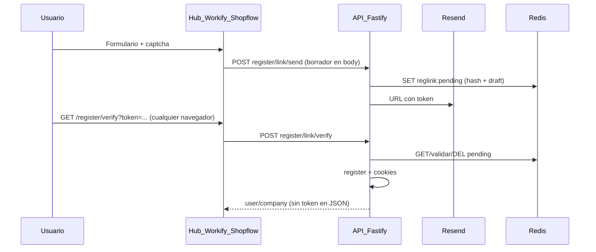

# PLAN-40 — Registro con enlace (magic link) y borrador en Redis

**Estado:** **completado (producto)** — cierre en repo **2026-04-12**. El alta empresarial usa **solo magic link** en Hub, Workify y Shopflow. El payload del formulario (incl. contraseña) vive en **Redis** hasta que el usuario abre el enlace; **`POST /v1/auth/register/link/verify`** completa el alta (BD + cookies), sin depender del navegador donde se pidió el correo.

**OTP pre-registro (PLAN-39):** Los handlers `POST /v1/auth/register/otp/send` y `.../verify` **siguen en el código** para reutilizar [`registration-otp.service.ts`](../../packages/api/src/services/registration-otp.service.ts) si hace falta. Por defecto están **cerrados en runtime**: `REGISTRATION_OTP_ENABLED=false` en [`config.ts`](../../packages/api/src/core/config.ts) → respuesta **403** con código `REGISTRATION_OTP_DISABLED`. Para reactivarlos (p. ej. integración legacy), definir `REGISTRATION_OTP_ENABLED=true` en el entorno de la API.

**Objetivo cumplido:** Magic link como **único camino en UI**; **Turnstile** en envío/reenvío; **Redis** con prefijo `reglink:pending:*` (hash del token + contadores + borrador JSON); **máximo 3 envíos** por ciclo; token **single-use**; ticket JWT (`company_register`) emitido dentro de `completeRegistrationFromLink` antes de `register`, igual que el flujo con ticket explícito.

**Referencia:** [`PLAN-39-company-registration-otp.md`](./%5Bcompleted%5D%20PLAN-39-company-registration-otp.md) (completado).

---

## 1. Contexto y estado actual

| Aspecto | Hoy |
|--------|-----|
| Backend | [`registration-otp.service.ts`](../../packages/api/src/services/registration-otp.service.ts): hash HMAC del código en Redis (`regotp:ch:...`), límites de envío e intentos fallidos; correo [`sendRegistrationOtpEmail`](../../packages/api/src/services/mailer.service.ts). |
| API | `POST /v1/auth/register/otp/send` y `POST /v1/auth/register/otp/verify` en [`auth.controller.ts`](../../packages/api/src/controllers/v1/auth.controller.ts). |
| Rate limit | [`rate-limit.plugin.ts`](../../packages/api/src/plugins/core/rate-limit.plugin.ts). |
| Ticket post-verificación | [`issueRegistrationTicket`](../../packages/api/src/services/registration-ticket.service.ts) → JWT + `regotp:jti:{jti}` en Redis hasta consumo en `register`. |
| Front | Hub [`RegisterPage.tsx`](../../apps/hub/src/views/RegisterPage.tsx); Workify [`RegisterForm.tsx`](../../apps/workify/src/components/forms/RegisterForm.tsx); Shopflow [`RegisterPage.tsx`](../../apps/shopflow/src/views/RegisterPage.tsx); [`api-client.ts`](../../apps/hub/src/lib/api-client.ts). |
| Config | [`config.ts`](../../packages/api/src/core/config.ts): `HUB_PUBLIC_URL`, `OTP_CHALLENGE_TTL_SECONDS`, `OTP_PEPPER`, `REGISTRATION_TICKET_*`, Redis vía [`getRedis`](../../packages/api/src/common/cache/redis.ts) (Upstash). |

---

## 2. Convención de persistencia (explícita): qué existe en cada capa

Esta sección fija la convención para evitar ambigüedad (“¿se crea la empresa en pending?”).

### 2.1 Postgres (Prisma) — cuándo se escribe

| Momento | ¿Hay `User` / `Company` / membresía? |
|--------|--------------------------------------|
| Tras `link/send` | **No** INSERT en Postgres. Se guarda blob efímero en Redis (`reglink:pending:*`) con hash del token y borrador de alta (TTL `OTP_CHALLENGE_TTL_SECONDS`). |
| Tras `link/verify` | **Sí** — en la implementación actual: se consume Redis, se emite `registrationTicket` y se llama a `auth.register` en la misma petición; respuesta equivalente a `POST /register` (cookies + envelope sin JWT en JSON). |
| Tras `POST /v1/auth/register` con ticket válido (clientes que no usan verify unificado) | **Sí.** Misma transacción en [`auth.service.ts`](../../packages/api/src/services/auth.service.ts). |

**PII en Redis:** El borrador incluye contraseña en claro durante el TTL (misma ventana de exposición que antes en `sessionStorage` del cliente). No loguear el blob; TTL acotado; HTTPS obligatorio en prod.

### 2.2 Redis — qué se guarda (efímero)

| Clave / patrón | Propósito | TTL |
|----------------|-----------|-----|
| **Link** `reglink:pending:{base64url(email)}` | Hash HMAC del token + contadores de envío (máx. 3) e intentos fallidos de verify + **JSON del borrador de alta** | `OTP_CHALLENGE_TTL_SECONDS` |
| Desafío **OTP** (`regotp:ch:...`) | Solo si `REGISTRATION_OTP_ENABLED=true` | Igual que PLAN-39 |
| `regotp:jti:{jti}` | Ancla el JWT `registrationTicket` hasta primer `register` válido (también usado al completar desde link) | `REGISTRATION_TICKET_EXPIRES_IN` |

### 2.3 Cliente (navegador)

- **Sin borrador local obligatorio:** La página `/register/verify` solo envía `email` + `token` al API; el servidor lee el borrador desde Redis.
- Opcional: [`register-draft.ts`](../../packages/shared/src/register-draft.ts) puede seguir existiendo en el paquete shared para otros usos; el flujo de registro de las apps ya no depende de él.

---

## 3. Compatibilidad con Vercel y runtime serverless

El diseño **es compatible** con Vercel siempre que el estado no dependa de memoria local del proceso.

### 3.1 Qué debe cumplirse

| Requisito | Motivo |
|-----------|--------|
| Redis **externo** (p. ej. Upstash) accesible desde la API | Las funciones Node en Vercel son **stateless**; no hay memoria compartida entre invocaciones. El patrón actual (`getRedis`) ya cumple esto. |
| **No** guardar desafíos solo en variable global / Map en memoria | Se pierde entre cold starts e instancias. |
| `HUB_PUBLIC_URL` en **producción** = URL HTTPS pública del Hub desplegado | El enlace del email debe apuntar al dominio correcto (preview vs production: usar env por entorno). |
| `RESEND_API_KEY`, `MAIL_FROM`, `TURNSTILE_SECRET_KEY`, secretos JWT/ticket en **env del proyecto API** en Vercel | Igual que hoy. |
| CORS y cookies entre dominio Hub y dominio API | Mantener la misma política que el login actual; PLAN-40 no cambia el contrato de sesión post-`register`. |

### 3.2 Despliegue típico en este monorepo

- **Hub (Next.js):** Vercel → sirve `/register`, `/register/verify`, assets.
- **API (Fastify empaquetada como serverless):** Vercel u otro host → endpoints `/v1/auth/register/link/*` y `register` existente.

No hace falta “sticky session” ni KV en Vercel para este flujo: **Redis + JWT** centralizan el estado.

### 3.3 Límites operativos a tener en cuenta

- Timeouts de función Vercel: el flujo send-mail + Redis es acotado; si algún paso crece (adjuntos, etc.), vigilar duración.
- Latencia Redis: elegir región coherente con la API cuando sea posible.

---

## 4. Riesgos y decisiones de producto

1. **Prefetch de enlaces (clientes de correo):** Algunos fetch previos pueden tocar la URL. **Mitigación:** token alta entropía; hash en Redis; **consumo del desafío solo vía `POST`** desde la página Hub (ver §7); no ejecutar `verify` en un GET que altere estado. Opcional: botón “Confirmar registro” que dispara el POST.
2. **Enumeración de emails:** Mantener la misma política que OTP (`send`: “ya existe usuario” vs genérico — alineado con implementación actual).
3. **OTP en API:** Código y rutas PLAN-39 conservados; **desactivados por defecto** con `REGISTRATION_OTP_ENABLED`. La UI ya no ofrece “código por email” en el alta.

---

## 5. Flujo objetivo (paso a paso)

1. Usuario completa formulario + aceptación legal + captcha → envía.
2. `POST /v1/auth/register/link/send` con **cuerpo completo** (email, captcha, password, nombres, empresa, flags de módulos, `verificationBaseUrl` opcional) → Turnstile, límites, token CSPRNG, guarda **blob** en Redis, envía email.
3. UI pasa a “Revisa tu correo”.
4. Usuario abre el enlace (cualquier navegador): `{origin}/register/verify?token=…&email=…` con `origin` acordado en `CORS_ORIGIN`.
5. `POST /v1/auth/register/link/verify` con `{ email, token }` → valida hash, borra clave Redis, emite ticket, ejecuta `register`, **cookies de sesión**, respuesta tipo `RegisterResponse`.

**Doble uso:** Tras `verify` exitoso, la entrada Redis se elimina; reintentos con el mismo enlace → `LINK_EXPIRED` / error controlado.

---

## 6. ~~Borrador en `sessionStorage`~~ (obsoleto para este flujo)

El borrador de alta vive en **Redis** hasta consumir el enlace. Las apps envían el mismo payload que antes se guardaba en cliente en el `POST .../link/send`.

---

## 7. Token del enlace y URL

| Aspecto | Especificación |
|---------|----------------|
| Generación | CSPRNG, p. ej. `randomBytes(32)` → **base64url** (sin `+`/`/` en URL) |
| Almacenamiento | Solo **HMAC/hash** en Redis con `OTP_PEPPER` + email normalizado (mismo patrón que [`hashOtpCode`](../../packages/api/src/services/registration-otp.service.ts), función nueva o compartida con nombre neutro tipo `hashRegistrationSecret`) |
| En email | URL absoluta: `{HUB_PUBLIC_URL}/register/verify?token={raw}&email={encodeURIComponent(email)}` |
| Transmisión a API | `POST` body `token` (raw) + `email`; comparación **timing-safe** tras hashear el raw igual que OTP |

**Importante:** El valor **raw** del token solo viaja en el enlace y en el body del POST desde el cliente del usuario; nunca en logs.

---

## 8. Contrato API

### 8.1 `POST /v1/auth/register/link/send`

- **Body:** `email`, `captchaToken`, `password`, `companyName`, `firstName`/`lastName` opcionales, flags de módulos opcionales, `verificationBaseUrl` opcional.
- **Respuesta:** envelope `success` / `{ sent: true }`.
- **Errores:** p. ej. `LINK_SEND_LIMIT`, `VERIFICATION_ORIGIN_NOT_ALLOWED`, `OTP_STORE_UNAVAILABLE`.

### 8.2 `POST /v1/auth/register/link/verify`

- **Body:** `{ email: string, token: string }`.
- **Éxito:** mismo envelope que `POST /v1/auth/register` (usuario, empresa, **cookies** httpOnly; sin `token` en JSON).
- **Errores sugeridos (códigos estables):**

| Código | Significado |
|--------|-------------|
| `INVALID_LINK` | Token incorrecto (hash no coincide) |
| `LINK_EXPIRED` | Sin desafío en Redis o TTL vencido |
| `LINK_VERIFY_LOCKOUT` | Opcional: si se implementa contador de intentos con token malformado/falso |
| `OTP_STORE_UNAVAILABLE` | Sin Redis (mismo que hoy) |

### 8.3 `POST /v1/auth/register`

- Sin cambio: sigue siendo el alta con ticket para clientes que lo invoquen directamente.

### 8.4 Endpoints OTP (PLAN-39) — flag de entorno

| Ruta | Política |
|------|----------|
| `POST /v1/auth/register/otp/send` | Si `REGISTRATION_OTP_ENABLED` es **false** (defecto): **403** `REGISTRATION_OTP_DISABLED`. Si **true**: comportamiento PLAN-39. |
| `POST /v1/auth/register/otp/verify` | Igual. |

- Variable: `REGISTRATION_OTP_ENABLED` en [`config.ts`](../../packages/api/src/core/config.ts) y [`packages/api/.env.example`](../../packages/api/.env.example).
- Rate limit: rutas `register/link/*` y `register/otp/*` en [`rate-limit.plugin.ts`](../../packages/api/src/plugins/core/rate-limit.plugin.ts).

---

## 9. Email

- Añadir **`sendRegistrationMagicLinkEmail(to: string, verifyUrl: string)`** en [`mailer.service.ts`](../../packages/api/src/services/mailer.service.ts).
- Asunto/copy orientados a “Confirma tu email para continuar el registro”; CTA claro; texto plano + HTML (patrón de [`sendEmailVerificationLink`](../../packages/api/src/services/mailer.service.ts)).

---

## 10. Hub (Next.js)

- [x] **`/register/verify`**: `POST link/verify` únicamente; sesión vía cookies; `acceptPrivacy` no bloqueante.
- [x] [`RegisterPage.tsx`](../../apps/hub/src/views/RegisterPage.tsx): solo magic link (sin OTP en UI).
- [x] [`api-client.ts`](../../apps/hub/src/lib/api-client.ts): `sendRegistrationLink` con cuerpo completo; `verifyRegistrationLink` → `RegisterResponse`.

---

## 11. Workify y Shopflow

- [x] `POST .../link/send` con payload completo + `verificationBaseUrl`; `/register/verify` alineado al Hub; `accountApi.acceptPrivacy` donde aplica.

---

## 12. Tests y observabilidad

- [x] Tests unitarios del nuevo servicio (envíos, expiración, verify ok → `issueRegistrationTicket`, verify doble → fallo).
- [x] Sin token/hash en assertions de logs.
- [x] Rate limit: entradas nuevas en plugin + prueba manual o test si existe harness.

---

## 13. Checklist de implementación

- [x] Servicio `registration-link` (o extensión clara del módulo actual), controller, DTOs/zod.
- [x] Claves Redis con prefijo `reglink:` **paralelo** a `regotp:` (convivencia permanente; no hay eliminación de OTP prevista en este plan).
- [x] `packages/api/.env.example`: comentario sobre `HUB_PUBLIC_URL` para links en staging/prod.
- [x] Hub: verify + register flow end-to-end.
- [x] Workify + Shopflow alineados (§11): cada app envía `verificationBaseUrl` = `window.location.origin` y expone `/register/verify` en su origen.

### 13.1 Verificación manual recomendada (post-despliegue)

No forma parte del checklist de implementación; conviene ejecutarla en staging o producción según entorno: registro feliz **por link**; link expirado; segundo uso de link; captcha en send y resend; con `REGISTRATION_OTP_ENABLED=true`, regresión **OTP** opcional.

---

## 14. Definición de hecho

- **Producto:** solo magic link en Hub / Workify / Shopflow; enlace utilizable desde **cualquier** navegador.
- **API:** `register/link/*` completa el alta en `verify`; `register/otp/*` deshabilitado por defecto (`REGISTRATION_OTP_ENABLED=false`).
- **Postgres:** no hay `User`/`Company` hasta ejecutar el alta (vía `link/verify` o `register` con ticket).
- Flujo verificable en **Vercel** con Redis Upstash y env correctos.
