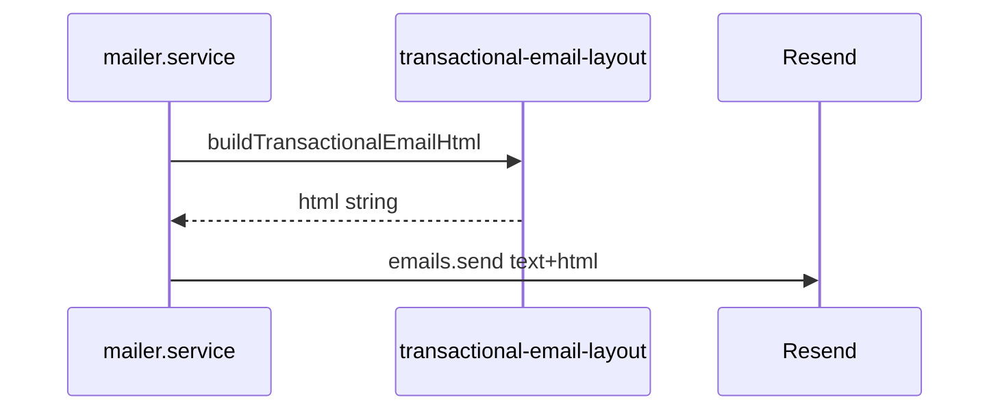

# Design: transactional-email-brand-layout

## Decision

| Topic | Choice | Rationale |
|-------|--------|-----------|
| Templating | TypeScript strings | PLAN-41; no new build pipeline; API already uses string HTML |
| Layout module | `transactional-email-layout.ts` | Single `buildTransactionalEmailHtml` + `escapeHtml` / `escapeHtmlAttr` |
| Logo | Optional `MAIL_BRAND_LOGO_URL` | PLAN-41; empty hides row |
| CTA | Table + anchor, indigo `#4f46e5`, 12px radius | Hero-aligned; inline `box-shadow` with accent alpha |

## Tokens (email-safe)

- Background `#0a0a0f`
- Headline solid `#a78bfa` (no `background-clip` text gradient)
- Body `rgba(255,255,255,0.88)`; muted `rgba(255,255,255,0.58)`
- Separator / accent `rgba(99,102,241,0.35)`
- Font stack with single-quoted `'Segoe UI'` inside double-quoted style attributes

## Rollback

Single revert removes layout + restores prior HTML strings.
