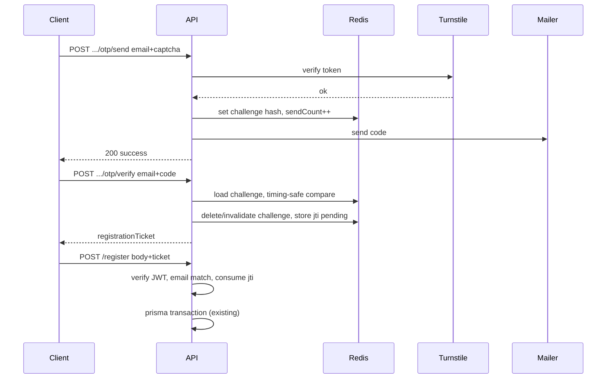

# Design: company-registration-otp

## Architecture

- **Controller**: valida DTO (Zod), delega en servicios; sin lógica de negocio.
- **Policy**: N/A para rutas públicas; comprobaciones de existencia de usuario en servicio/reglas explícitas.
- **Services**: `registration-otp.service` (send/verify, límites), `mailer` (envío), `turnstile` (verify remoto), `registration-ticket` (emit/consumir JWT + Redis `jti`).
- **Redis keys** (prefijo p. ej. `regotp:`): challenge por email (`hash`, `sendCount`, `failCount`, TTL); `jti` consumido para ticket one-time.

## Sequence (happy path)

## Decisions

| Decision | Choice | Rationale |
|----------|--------|-----------|
| OTP storage | Redis + hashed code | TTL nativo; PLAN-39; sin migración Prisma inicial |
| Ticket signing | `REGISTRATION_TICKET_SECRET` o fallback `JWT_SECRET` | Separación opcional; dev simple |
| Captcha | Cloudflare Turnstile | PLAN-39 |
| Sin Redis | Error estable en OTP | Evitar estado inconsistente |

## Env (API)

- `TURNSTILE_SECRET_KEY`, `OTP_PEPPER`, `REGISTRATION_TICKET_SECRET` (opcional)
- Correo: **Resend** — `RESEND_API_KEY`, `MAIL_FROM` (dominio verificado o remitente de prueba Resend)

## Rollback

Feature flag no requerido: revertir commit elimina rutas y validación de ticket; clientes antiguos sin ticket fallan solo en registro con empresa (comunicar versión mínima).
