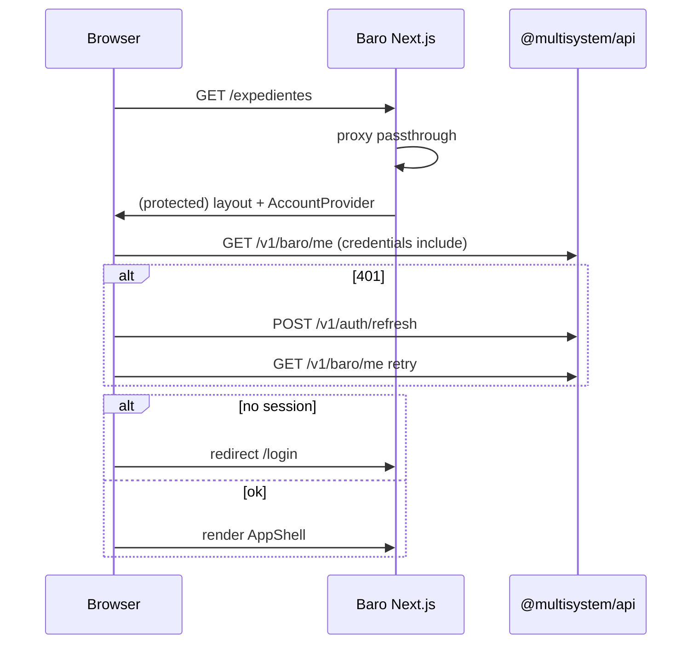

# Design: Baro Turbopack build + auth alignment

## Decisions

### D1 — Edge proxy does not validate API session cookies

**Choice:** `proxy.ts` passes through when `AUTH_ENABLED=true`; protected UI relies on `AppSessionGate` + `GET /v1/baro/me`.

**Rationale:** ADR-auth-token-storage — `ms_session` is httpOnly on the API host. Baro origin cannot read it in middleware/proxy. Hub uses the same pattern.

**Rejected:** Restore upstream `ACCESS_COOKIE` JWT check on baro origin — incompatible with multisystem auth.

### D2 — Default Turbopack build

**Choice:** `"build": "next build"` (no `--webpack`).

**Rationale:** Other monorepo apps use Turbopack build; production runs standalone `node apps/baro/server.js` after `turborepo-conventions` Slice C. Historical ChunkLoadError was tied to `next start` + webpack chunks on Windows/IIS.

### D3 — Client calls API directly (no baro-local BFF)

**Choice:** Replace `/api/auth/*` with `lib/api/client.ts` (`authApi`, `baroApi`) targeting `NEXT_PUBLIC_API_URL`.

**Mapping:**

| Legacy path | API |
|-------------|-----|
| `POST /api/auth/login` | `POST /v1/auth/login` |
| `POST /api/auth/logout` | `POST /v1/auth/logout` |
| `POST /api/auth/refresh` | `POST /v1/auth/refresh` |
| `GET /api/auth/me` | `GET /v1/baro/me` |
| `GET/PATCH /api/auth/profile` | `GET/PATCH /v1/baro/profile` |
| `GET /api/auth/associated-professionals` | `GET /v1/baro/professionals/collaborators` |
| `GET/PATCH/POST/DELETE .../associated-professionals/:id` | `/v1/baro/professionals/:id` |

**Register:** redirect to `NEXT_PUBLIC_HUB_URL/register` (spec: registration via Hub).

### D4 — `lib/auth/client.ts` scope

Exports only `isAuthEnabled()` for proxy and tests. No fake cookie validation helpers.

## Flow (session check)

## Files

- `apps/baro/lib/auth/client.ts` — new
- `apps/baro/proxy.ts` — simplify
- `apps/baro/lib/api/client.ts` — extend authApi
- `apps/baro/components/app/account-context.tsx` — baroApi + ApiError
- `apps/baro/components/auth-form.tsx` — login via API; register → Hub
- Other components listed in `tasks.md`
